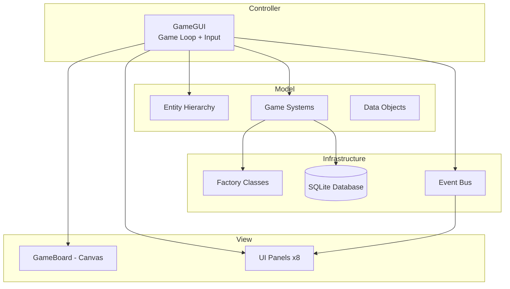
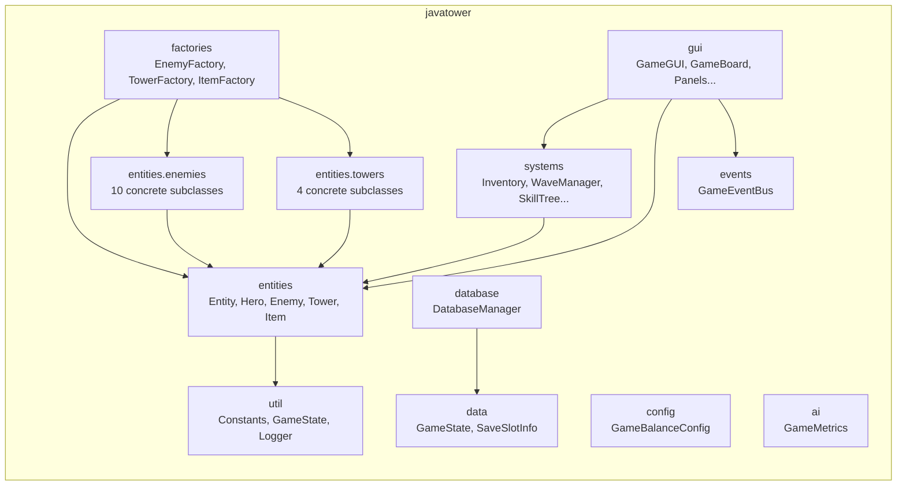
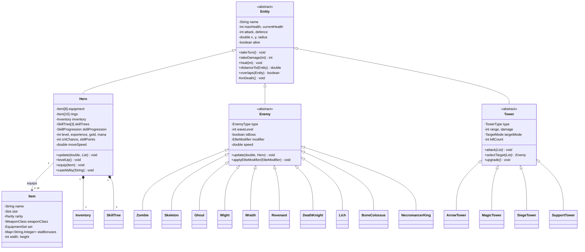
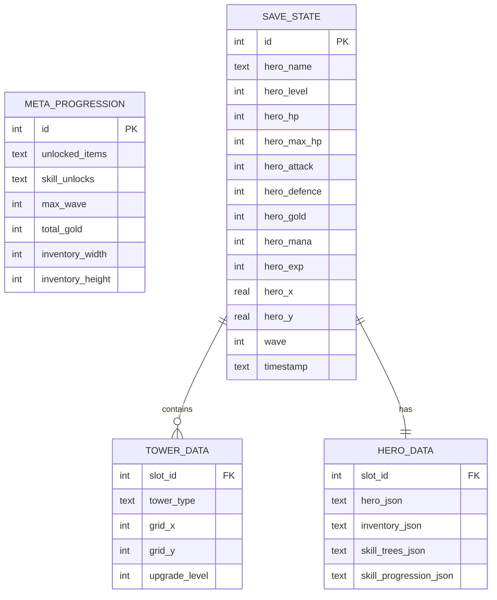

# JavaTower — Final Report

**CIS096-1 — Principles of Programming and Data Structures**
**Assessment 2 — OOP Architecture & Implementation**

---

| Field | Details |
|-------|---------|
| Unit Code | CIS096-1 |
| Assessment | 2 — OOP Architecture & Implementation |
| Submission | Week 9 |
| Programme | BSc Computer Science |

### Authors

| Name | Student ID |
|------|------------|
| Vincent Chamberlain | 2424309 |
| Nicolas Alfaro | 2301126 |
| Emmanuel Adewumi | 2507044 |

---

## Table of Contents

1. [Introduction](#1-introduction)
2. [Requirements Analysis](#2-requirements-analysis)
3. [System Design](#3-system-design)
4. [OOP Architecture](#4-oop-architecture)
5. [Design Patterns](#5-design-patterns)
6. [Data Structures & Algorithms](#6-data-structures--algorithms)
7. [Implementation Details](#7-implementation-details)
8. [Database Design](#8-database-design)
9. [Testing & Quality Assurance](#9-testing--quality-assurance)
10. [Evaluation & Reflection](#10-evaluation--reflection)
11. [Conclusion](#11-conclusion)
12. [References](#12-references)
13. [Appendices](#13-appendices)

---

## 1. Introduction

### 1.1 Project Overview

JavaTower is a real-time tower defence RPG developed as the group project component of CIS096-1 (Principles of Programming and Data Structures). The application demonstrates advanced object-oriented programming concepts including inheritance hierarchies, polymorphism, encapsulation, abstraction, factory patterns, observer patterns, and the use of multiple data structures.

The game challenges the player to defend against 30 waves of progressively harder undead enemies by controlling a hero character and strategically placing defensive towers on a grid-based map.

### 1.2 Objectives

The primary objectives of this project were to:

1. **Demonstrate OOP principles** — Implement a non-trivial system using inheritance, polymorphism, encapsulation, and abstraction.
2. **Apply data structures** — Use arrays, lists, maps, sets, and custom composite structures effectively.
3. **Employ design patterns** — Apply industry-standard patterns (Factory, Observer, Singleton, Strategy, Template Method) where appropriate.
4. **Build a working application** — Create a playable, complete game with a graphical user interface using JavaFX.
5. **Persist data** — Use JDBC and SQLite for saving and loading game state.
6. **Work collaboratively** — Divide work across team members and integrate using Git version control.

### 1.3 Technologies

| Technology | Version | Purpose |
|------------|---------|---------|
| Java | 21 (LTS) | Core language — records, sealed classes, pattern matching |
| JavaFX | 21.0.2 | GUI framework — Canvas, layout panes, event handling |
| SQLite | 3.45.1.0 | Embedded database — game state persistence |
| JDBC | Built-in | Database connectivity |
| Git | Latest | Version control and collaboration |

### 1.4 Scope

The game includes:
- A real-time game loop running at 60 frames per second
- 10 distinct enemy types organised into a class hierarchy
- 4 tower types with upgrade paths and proximity synergies
- A hero character with equipment, skills, abilities, and movement
- Tetris-style grid inventory system
- Equipment sets with 2-piece and 4-piece bonuses
- Branching skill trees with prerequisites
- Item forging (combine duplicates to upgrade rarity)
- Elite enemy modifiers and wave modifiers
- Save/load system with 4 slots via SQLite
- Complete GUI with multiple screens (game, shop, inventory, skill tree, forge)

---

## 2. Requirements Analysis

### 2.1 Functional Requirements

| ID | Requirement | Status |
|----|-------------|--------|
| FR-01 | Player can control a hero character using keyboard input (WASD/arrows) | Implemented |
| FR-02 | Player can place towers on a grid-based map | Implemented |
| FR-03 | Enemies spawn in waves of increasing difficulty | Implemented (30 waves) |
| FR-04 | Hero and towers attack enemies in real-time | Implemented (60 FPS) |
| FR-05 | Enemies drop items and award gold/XP on death | Implemented |
| FR-06 | Player can equip items in designated slots | Implemented (8 slots + 10 rings) |
| FR-07 | Inventory uses grid-based placement (Tetris-style) | Implemented (2D array) |
| FR-08 | Player can buy/sell items between waves | Implemented (Shop) |
| FR-09 | Skill trees allow stat upgrades with prerequisites | Implemented (5 trees, branching prerequisites) |
| FR-10 | Game state can be saved and loaded | Implemented (SQLite, 4 slots) |
| FR-11 | Tower synergies based on proximity | Implemented (5 synergy types) |
| FR-12 | Equipment sets provide bonus stats | Implemented (5 sets, 2pc/4pc) |
| FR-13 | Items can be forged to upgrade rarity | Implemented (COMMON → LEGENDARY) |
| FR-14 | Elite enemies with random modifiers | Implemented (8 modifier types) |
| FR-15 | Boss encounters at milestone waves | Implemented (waves 5, 10, 15, 20, 25, 30) |

### 2.2 Non-Functional Requirements

| ID | Requirement | Status |
|----|-------------|--------|
| NFR-01 | 60 FPS gameplay with no visible stutter | Achieved via AnimationTimer |
| NFR-02 | Modular codebase with clear package structure | 12 packages, 58 files |
| NFR-03 | Follows OOP best practices | 4 pillars + 11 design patterns |
| NFR-04 | Database auto-creates on first run | Achieved (CREATE IF NOT EXISTS) |
| NFR-05 | Cross-platform compatible (Windows/macOS/Linux) | JavaFX + JDBC (tested Windows) |

---

## 3. System Design

### 3.1 Architecture Overview

The application follows a **Model-View-Controller (MVC)** architectural pattern adapted for real-time game development:

- **Model**: Entity classes (Hero, Enemy, Tower, Item), system classes (Inventory, SkillTree, WaveManager)
- **View**: GUI classes (GameBoard canvas renderer, HeroPanel, InventoryPanel, etc.)
- **Controller**: GameGUI (game loop, input handling, state transitions)



### 3.2 Package Diagram



### 3.3 Class Diagram — Full Entity Hierarchy



---

## 4. OOP Architecture

This section details how the four pillars of OOP are applied throughout the codebase, as required by the assessment criteria.

### 4.1 Abstraction

**Abstraction** hides complex implementation details behind simplified interfaces, allowing users of a class to work with high-level concepts rather than low-level mechanics.

#### Abstract Classes

The `Entity` class is the foundation of the entire game object model. It defines the **interface contract** that all game entities must honour without dictating how each entity implements its behaviour:

```java
// Entity.java — abstract base class
abstract class Entity {
    private String name;
    private int maxHealth, currentHealth;
    private int attack, defence;
    private double x, y, radius;
    private boolean alive;

    // Abstract method — each entity type defines its own behaviour
    abstract void takeTurn();

    // Concrete method — shared damage formula
    int takeDamage(int damage) {
        int actualDamage = Math.max(1, damage - defence);
        currentHealth -= actualDamage;
        if (currentHealth <= 0) {
            alive = false;
            onDeath(); // Hook for subclass-specific death behaviour
        }
        return actualDamage;
    }

    // Template hook — subclasses optionally override
    protected void onDeath() { }
}
```

The abstract `Enemy` class further refines the contract by adding AI-specific abstractions:

```java
// Enemy.java — abstract enemy with type system
abstract class Enemy extends Entity {
    enum EnemyType {
        ZOMBIE(1, 30, 5, 2, 10, 5),     // tier, hp, atk, def, xp, gold
        SKELETON(2, 25, 8, 1, 15, 8),
        // ... 8 more types
        NECROMANCER_KING(10, 500, 30, 20, 500, 200);

        final int tier, baseHp, baseAtk, baseDef, xpValue, goldValue;
    }
}
```

The `EnemyType` enum **abstracts** the stat-scaling logic — new enemy types only need to add an enum constant rather than write a new class with hardcoded values.

#### Enums as Abstract Data Types

Enums throughout the project serve as **abstract data types** that encapsulate related constants and behaviour:

- `Item.Rarity` — COMMON(1.0), UNCOMMON(1.2), RARE(1.5), EPIC(2.0), LEGENDARY(3.0) — each rarity carries a multiplier
- `Item.Slot` — WEAPON, OFFHAND, HELMET, etc. — defines valid equipment positions
- `Tower.TargetMode` — NEAREST, STRONGEST, WEAKEST, FIRST — encapsulates targeting algorithms
- `EliteModifier` — FAST, TANKY, VAMPIRIC, etc. — wraps modifier logic in enum constants
- `WaveModifier` — SWARM, RUSH, DARKNESS, etc. — wave-level difficulty adjustments

### 4.2 Encapsulation

**Encapsulation** bundles data with the methods that operate on it and restricts direct access to internal state.

#### Access Control

All entity fields use `private` access with controlled getters/setters:

```java
// Hero.java — encapsulated state
class Hero extends Entity {
    private int gold = 50;          // private — cannot be set directly
    private int mana = 50;
    private int maxMana = 50;

    // Controlled mutation — validates and fires events
    public void gainGold(int amount) {
        if (amount > 0) {
            gold += amount;
            totalGoldEarned += amount;  // Track stats
        }
    }

    // Read-only access
    public int getGold() { return gold; }
}
```

#### Inventory Validation

The `Inventory` class encapsulates its 2D grid and prevents invalid placements:

```java
// Inventory.java — encapsulated Tetris grid
class Inventory {
    private boolean[][] occupied;   // private grid state
    private Item[][] itemGrid;      // private item references

    // Public method — validates before mutating
    public boolean canPlaceItem(Item item, int row, int col) {
        for (int r = row; r < row + item.getHeight(); r++) {
            for (int c = col; c < col + item.getWidth(); c++) {
                if (r >= rows || c >= cols || occupied[r][c]) return false;
            }
        }
        return true;
    }

    public boolean addItem(Item item) {
        // Finds first valid position, returns false if full
        for (int r = 0; r < rows; r++) {
            for (int c = 0; c < cols; c++) {
                if (canPlaceItem(item, r, c)) {
                    placeItem(item, r, c);  // private mutation
                    return true;
                }
            }
        }
        return false;
    }
}
```

#### Singleton Database Access

The `DatabaseManager` encapsulates all database operations behind a single controlled access point:

```java
// DatabaseManager.java — Singleton pattern
class DatabaseManager {
    private static DatabaseManager instance;
    private Connection connection;

    private DatabaseManager() { /* private constructor */ }

    public static DatabaseManager getInstance() {
        if (instance == null) {
            instance = new DatabaseManager();
            instance.connect();
        }
        return instance;
    }
}
```

### 4.3 Inheritance

**Inheritance** establishes ``is-a'' relationships, allowing code reuse and specialisation.

#### Three-Level Entity Hierarchy

```
Entity (abstract)
├── Hero (concrete — single instance)
├── Enemy (abstract — 10 concrete subclasses)
│   ├── Zombie        — basic melee, tier 1
│   ├── Skeleton      — ranged, tier 2
│   ├── Ghoul         — fast melee, tier 3
│   ├── Wight         — magic resistant, tier 4
│   ├── Wraith        — phases through walls, tier 5
│   ├── Revenant      — resurrects once, tier 6
│   ├── DeathKnight   — heavy melee, tier 7
│   ├── Lich          — summons minions, tier 8
│   ├── BoneColossus  — AoE boss, tier 9
│   └── NecromancerKing — final boss, tier 10
│
└── Tower (abstract — 4 concrete subclasses)
    ├── ArrowTower    — fast single-target
    ├── MagicTower    — hits phasing enemies
    ├── SiegeTower    — slow AoE damage
    └── SupportTower  — heals hero, buffs towers
```

Each level of the hierarchy **adds** rather than duplicates functionality:
- **Entity** provides: health, position, collision detection, damage calculation
- **Enemy** adds: AI movement, attack cooldowns, elite modifiers, XP/gold values, bone pile consumption
- **Zombie** inherits everything and only needs to specify its `EnemyType.ZOMBIE` in the constructor

```java
// Zombie.java — minimal subclass, inherits all behaviour
package javatower.entities.enemies;
import javatower.entities.Enemy;

public class Zombie extends Enemy {
    public Zombie(int waveLevel) {
        super(EnemyType.ZOMBIE, waveLevel);
    }
}
```

The `Lich` enemy overrides inherited behaviour to add unique summoner AI:

```java
// Lich.java — specialised subclass with bone-seeking AI
public class Lich extends Enemy {
    public Lich(int waveLevel) { super(EnemyType.LICH, waveLevel); }

    @Override
    public void update(double dt, Hero hero) {
        // Seek nearest bone pile when summon is ~70% ready
        if (summonReady > 0.7 && nearestBonePile != null) {
            smoothMoveToward(pile.getX(), pile.getY(), dt);
            if (distanceTo(pile) < 30) consumeAndSummon();
        } else {
            super.update(dt, hero);  // Fall back to inherited AI
        }
    }
}
```

#### JavaFX Inheritance

```java
// GameGUI.java extends JavaFX Application
public class GameGUI extends Application {
    @Override
    public void start(Stage primaryStage) {
        // Set up game window, initialise scenes
    }
}
```

### 4.4 Polymorphism

**Polymorphism** allows objects of different types to respond to the same method call with type-specific behaviour.

#### Runtime Polymorphism — Tower Attacks

All towers share the same `attack(List<Enemy> enemies)` signature, but each implements it differently:

```java
// ArrowTower.java — single-target fast attack
@Override
public void attack(List<Enemy> enemies) {
    Enemy target = selectTarget(enemies);
    if (target != null) {
        target.takeDamage(getEffectiveDamage());
        recordDamage(getEffectiveDamage());
    }
}

// SiegeTower.java — area-of-effect slow attack
@Override
public void attack(List<Enemy> enemies) {
    Enemy primary = selectTarget(enemies);
    if (primary != null) {
        for (Enemy e : enemies) {
            if (e.distanceTo(primary) < SPLASH_RADIUS) {
                e.takeDamage(getEffectiveDamage());
                recordDamage(getEffectiveDamage());
            }
        }
    }
}

// SupportTower.java — heals instead of attacking
@Override
public void attack(List<Enemy> enemies) {
    healHero(hero);
    buffNearbyTowers(towers);
}
```

The game loop treats all towers uniformly through subtype polymorphism:

```java
// GameGUI.java — polymorphic tower update
for (Tower tower : towers) {
    tower.update(dt, enemies);  // Calls correct subclass attack()
}
```

#### Factory Polymorphism

The `EnemyFactory` returns different `Enemy` subclasses from a single method:

```java
// EnemyFactory.java — returns polymorphic Enemy references
public static Enemy createEnemy(Enemy.EnemyType type, int waveLevel) {
    return switch (type) {
        case ZOMBIE           -> new Zombie(waveLevel);
        case SKELETON         -> new Skeleton(waveLevel);
        case GHOUL            -> new Ghoul(waveLevel);
        // ... 7 more types
        case NECROMANCER_KING -> new NecromancerKing(waveLevel);
    };
}
```

The caller receives an `Enemy` reference and works with it through the base class interface — it does not need to know or care about the concrete type.

#### Collection Polymorphism

```java
// Lists hold mixed concrete types — all accessed through base interface
List<Enemy> enemies = new ArrayList<>();
enemies.add(new Zombie(1));
enemies.add(new Lich(8));
enemies.add(new NecromancerKing(10));

// All respond to the same update() call
for (Enemy e : enemies) {
    e.update(dt, hero);  // Zombie moves simply, Lich seeks bones, King casts spells
}
```

---

## 5. Design Patterns

### 5.1 Factory Pattern (Abstract Factory + Factory Method)

**Problem**: The game needs to create many different types of entities (enemies, towers, items) with varying configurations based on wave number, difficulty, and randomness.

**Solution**: Three factory classes centralise entity creation:

```java
// Creating an enemy — client code doesn't know concrete type
Enemy enemy = EnemyFactory.createEnemy(EnemyType.LICH, waveLevel);
enemy.applyEliteModifier(EliteModifier.VAMPIRIC);

// Creating a tower — factory handles all initialisation
Tower tower = TowerFactory.createTower(TowerType.ARROW, gridX, gridY);

// Creating items — with tier-based drop rates
Item drop = ItemFactory.rollDrop(enemyTier, isBoss);
```

**Benefit**: Adding new enemy types requires only a new subclass and a new enum constant — the factory pattern means **zero changes** to the game loop or UI code.

### 5.2 Observer Pattern (GameEventBus)

**Problem**: Many systems need to react to game events (enemy killed, hero levelled up, wave completed) but should not be tightly coupled to the source of those events.

**Solution**: A generic event bus using Java generics and the `Consumer<T>` functional interface:

```java
// GameEventBus.java — generic observer pattern
public class GameEventBus<T> {
    private Map<String, List<Consumer<T>>> listeners = new HashMap<>();

    public void subscribe(String event, Consumer<T> listener) {
        listeners.computeIfAbsent(event, k -> new ArrayList<>()).add(listener);
    }

    public void publish(String event, T data) {
        List<Consumer<T>> subs = listeners.get(event);
        if (subs != null) {
            for (Consumer<T> listener : subs) {
                listener.accept(data);
            }
        }
    }
}
```

**Usage**:
```java
// CombatLogPanel subscribes to events
eventBus.subscribe("ENEMY_KILLED", data -> addLogEntry("Killed " + data));

// GameGUI publishes when an enemy dies
eventBus.publish("ENEMY_KILLED", enemy.getName());
```

**Benefit**: The `CombatLogPanel` knows nothing about `GameGUI`, and `GameGUI` knows nothing about `CombatLogPanel`. New listeners can be added without modifying any existing code — adhering to the **Open/Closed Principle**.

### 5.3 Singleton Pattern (DatabaseManager)

**Problem**: Multiple systems (SaveGameManager, game loop, UI) need database access, but only one connection should exist.

**Solution**: Classic Singleton with lazy initialisation:

```java
public class DatabaseManager {
    private static DatabaseManager instance;
    private Connection connection;

    private DatabaseManager() { }

    public static DatabaseManager getInstance() {
        if (instance == null) {
            instance = new DatabaseManager();
        }
        return instance;
    }
}
```

### 5.4 Strategy Pattern (Tower Targeting + Synergies)

**Problem**: Towers need configurable targeting behaviour that can be changed at runtime by the player.

**Solution**: The `TargetMode` enum encapsulates different selection strategies:

```java
// Tower.java — strategy pattern via enum
enum TargetMode { NEAREST, STRONGEST, WEAKEST, FIRST }

protected Enemy selectByMode(List<Enemy> inRange) {
    return switch (targetMode) {
        case NEAREST   -> inRange.stream().min(Comparator.comparingDouble(e -> distanceTo(e))).orElse(null);
        case STRONGEST -> inRange.stream().max(Comparator.comparingInt(Enemy::getCurrentHealth)).orElse(null);
        case WEAKEST   -> inRange.stream().min(Comparator.comparingInt(Enemy::getCurrentHealth)).orElse(null);
        case FIRST     -> inRange.get(0);
    };
}
```

The `TowerSynergyManager` also uses the Strategy pattern to apply different bonus calculations based on tower proximity combinations.

### 5.5 Template Method Pattern (Entity lifecycle)

**Problem**: All entities share the same lifecycle (take damage, check death, execute death behaviour) but need type-specific death handling.

**Solution**: The `takeDamage()` method in `Entity` defines the algorithm skeleton, with `onDeath()` as a hook for subclasses:

```java
// Entity.java — template method
int takeDamage(int damage) {
    int actual = Math.max(1, damage - defence);  // Step 1: Calculate
    currentHealth -= actual;                      // Step 2: Apply
    if (currentHealth <= 0) {
        alive = false;
        onDeath();  // Step 3: Hook — subclasses override
    }
    return actual;
}

// Revenant overrides the hook to resurrect
@Override
protected void onDeath() {
    if (!hasResurrected) {
        alive = true;
        currentHealth = maxHealth / 2;
        hasResurrected = true;
    }
}
```

### 5.6 Decorator Pattern (Elite Modifiers)

**Problem**: Enemies need optional stat modifications applied dynamically at spawn time.

**Solution**: `EliteModifier` acts as a decorator, augmenting enemy stats without subclassing:

```java
public void applyEliteModifier(EliteModifier mod) {
    this.eliteModifier = mod;
    switch (mod) {
        case FAST -> { speed *= 1.5; maxHealth = (int)(maxHealth * 0.8); }
        case TANKY -> { maxHealth = (int)(maxHealth * 1.5); speed *= 0.7; }
        case VAMPIRIC -> { maxHealth = (int)(maxHealth * 1.2); /* + heal on hit */ }
        case SHIELDED -> { hasShield = true; }
        // ... more modifiers
    }
}
```

### 5.7 State Pattern (Game Flow)

The `GameState` enum manages screen transitions:

```java
enum GameState {
    MAIN_MENU, PLAYING, SHOPPING, PAUSED, INVENTORY,
    SKILL_TREE, FORGE, GAME_OVER, VICTORY
}
```

State transitions are enforced in `GameGUI` — for example, the Shop is only accessible when the wave is complete (`SHOPPING` state), and the game loop only updates entities in the `PLAYING` state.

### 5.8 Summary of Patterns Used

| Pattern | Where | OOP Principle |
|---------|-------|--------------|
| Abstract Factory | EnemyFactory, TowerFactory | Abstraction, Polymorphism |
| Factory Method | ItemFactory | Abstraction |
| Singleton | DatabaseManager | Encapsulation |
| Observer | GameEventBus | Abstraction, loose coupling |
| Strategy | TargetMode, TowerSynergyManager | Polymorphism |
| Template Method | Entity.takeDamage() / onDeath() | Inheritance, Polymorphism |
| Decorator | EliteModifier | Polymorphism |
| State | GameState enum | Encapsulation |
| Composite | Inventory 2D grid | Abstraction |
| DTO | GameState (data), SaveSlotInfo | Encapsulation |
| MVC | GameGUI / GameBoard / Entity model | Abstraction |

---

## 6. Data Structures & Algorithms

### 6.1 Data Structures Used

#### ArrayList<T> — Dynamic Arrays

The primary collection throughout the application. Used for enemies, towers, visual effects, items, and skill nodes.

```java
// GameGUI.java
private List<Tower> towers = new ArrayList<>();
private List<Enemy> enemies = new ArrayList<>();
private List<VisualEffect> effects = new ArrayList<>();
private List<BonePile> bonePiles = new ArrayList<>();
```

**Justification**: O(1) random access for rendering loops, amortised O(1) append for spawning. The game iterates over all entities every frame (60 times per second), making ArrayList's cache-friendly contiguous memory layout ideal.

#### HashMap<K,V> — Key-Value Maps

Used for stat bonus lookups, event listener registration, and skill XP tracking.

```java
// Item.java — stat bonuses
private Map<String, Integer> statBonuses = new HashMap<>();

// GameEventBus.java — event listeners
private Map<String, List<Consumer<T>>> listeners = new HashMap<>();

// SkillProgression.java — weapon skill XP
private Map<String, Integer> weaponXP = new HashMap<>();
```

**Justification**: O(1) average-case lookup for stat calculations performed every frame.

#### 2D Arrays — Inventory Grid

The Tetris-style inventory uses two parallel 2D arrays:

```java
// Inventory.java
private boolean[][] occupied;    // O(1) occupancy check
private Item[][] itemGrid;       // O(1) item lookup by position
```

**Justification**: Fixed-size grid with frequent random access. 2D arrays provide O(1) access without the overhead of Collection objects.

#### Enum Types — Type-Safe Constants

Enums replace magic numbers and strings throughout:

```java
enum EnemyType {
    ZOMBIE(1, 30, 5, 2, 10, 5),
    // Encapsulates: tier, baseHp, baseAtk, baseDef, xpValue, goldValue
}

enum Rarity {
    COMMON(1.0), UNCOMMON(1.2), RARE(1.5), EPIC(2.0), LEGENDARY(3.0);
    // Encapsulates stat multiplier
}
```

**Justification**: Type safety at compile time, associated data, and exhaustive switch handling.

#### LinkedHashMap — Ordered Event Log

```java
// CombatLogPanel — maintains insertion order for display
private LinkedHashMap<Long, String> eventLog;
```

**Justification**: O(1) insertion + iteration in insertion order for the combat log display.

#### HashSet<String> — Unique Tracking

```java
// DatabaseManager — track unlocked items
private HashSet<String> unlockedItems;
```

**Justification**: O(1) membership test — "has the player unlocked this item before?"

### 6.2 Algorithms

#### Collision Detection — Circle Overlap

```java
// Entity.java — O(1) per pair
boolean overlaps(Entity other) {
    double dx = x - other.x;
    double dy = y - other.y;
    double dist = Math.sqrt(dx * dx + dy * dy);
    return dist < (radius + other.radius);
}
```

Used for: hero-enemy combat, tower targeting, projectile hits, bone pile pickup.

#### Nearest-Enemy Search — Linear Scan

```java
// O(n) per tower per frame
for (Enemy e : enemies) {
    if (distanceTo(e) < range && distanceTo(e) < closestDist) {
        closest = e;
        closestDist = distanceTo(e);
    }
}
```

**Complexity**: O(T × E) per frame where T = towers, E = enemies. With T ≤ 15 and E ≤ 60, this is bounded at ~900 comparisons per frame — well within the 16ms budget.

#### Tetris Item Placement — Brute Force Grid Scan

```java
// O(R × C × H × W) per placement attempt
for (int r = 0; r < rows; r++) {
    for (int c = 0; c < cols; c++) {
        if (canPlaceItem(item, r, c)) {
            placeItem(item, r, c);
            return true;
        }
    }
}
```

With a small grid (initially 3×3, max ~6×6), this is effectively constant time.

#### Skill Tree — Graph Traversal for Prerequisites

```java
// SkillNode prerequisite check
boolean canUnlock() {
    for (SkillNode prereq : prerequisites) {
        if (!prereq.isUnlocked()) return false;
    }
    return true;
}
```

The skill tree is a DAG (Directed Acyclic Graph) with 5 nodes per tree and at most 2 prerequisites per node. Prerequisite checking is O(P) where P ≤ 2.

---

## 7. Implementation Details

### 7.1 Game Loop

The game uses JavaFX's `AnimationTimer` for a fixed-timestep game loop:

```java
// GameGUI.java — 60 FPS game loop
AnimationTimer gameLoop = new AnimationTimer() {
    private long lastTime = 0;

    @Override
    public void handle(long now) {
        if (lastTime == 0) { lastTime = now; return; }
        double dt = (now - lastTime) / 1_000_000_000.0; // nanoseconds → seconds
        lastTime = now;

        if (gameState == GameState.PLAYING) {
            updateGame(dt);
            renderFrame();
        }
    }
};
```

The `dt` (delta time) parameter ensures physics and movement are frame-rate independent.

### 7.2 Rendering Pipeline

All game world rendering uses a single JavaFX `Canvas` with `GraphicsContext`:

1. Clear canvas
2. Draw grid and terrain
3. Draw towers (with synergy effects)
4. Draw enemies (with health bars and elite indicators)
5. Draw hero (procedural pixel-art sprite, equipment-coloured)
6. Draw visual effects (projectiles, particles, damage numbers)
7. Draw HUD overlay (mana bar, ability cooldowns, run timer, wave info)
8. Draw tower hover tooltip (if hovering)
9. Draw mini-map

### 7.3 Input Handling

Keyboard input is captured via JavaFX event handlers and processed in the game loop:

```java
scene.setOnKeyPressed(e -> {
    switch (e.getCode()) {
        case W, UP    -> hero.setMoveUp(true);
        case S, DOWN  -> hero.setMoveDown(true);
        case A, LEFT  -> hero.setMoveLeft(true);
        case D, RIGHT -> hero.setMoveRight(true);
        case Q        -> castAbility("primary");
        case E        -> castAbility("heal");
        case DIGIT1   -> selectTowerType(ARROW);
        // ... more bindings
    }
});
```

### 7.4 Visual Effects System

The `VisualEffect` class handles all particle and animation effects:

- **Projectile trails** — animated projectiles from towers to targets
- **Damage numbers** — floating text showing damage dealt
- **Level-up flash** — golden ring and sparkle particles
- **Death dissolve** — shrinking circle with smoke particles
- **Item drops** — floating item names with rarity-coded colours

Each effect has an `age` and `maxAge`, and is automatically removed when expired.

### 7.5 Tower Synergy System

The `TowerSynergyManager` checks all tower pairs within 150px proximity:

```
Arrow + Magic  → Arcane Arrows (pierce)
Magic + Siege  → Gravity Well (pull + damage)
Siege + Support → Overclocked (2× speed)
Support + Support → Network (range)
Arrow × 3     → Volley (synchronised fire)
```

Synergies apply `double` multipliers to damage, attack speed, and range — demonstrating composition over inheritance (towers gain abilities through proximity rather than subclassing).

### 7.6 Class Passive Ability Integration

Recent implementation work focused on wiring skill-tree passives into live combat logic, which is directly relevant to the assignment's OOP and integration criteria.

1. **Necromancer summon scaling**
    - `necroSummonBonus` (from Necromancer tree callbacks) is applied in summon-damage formulas.
    - NECROMANCY weapon-class threshold passives are processed through `SetBonusManager` and consumed by `Hero.processClassAutoSpells(...)`.

2. **Pyromancer elemental summon**
    - Tier-4 node `f4c` unlocks a Fire Elemental passive (`pyroElementalActive`).
    - Elemental attacks are triggered on cooldown and scale with `pyroFireBonus`.

3. **Respec safety and state invariants**
    - Respec now calls `hero.resetSkillTreeSpecialBonuses()` before re-applying unlocked-node callbacks.
    - This prevents stale callback fields from stacking incorrectly across multiple respecs.

These changes provide clear evidence of encapsulation (state owned/mutated in `Hero`), polymorphism (shared `Enemy` interactions), and separation of concerns (`SetBonusManager` for rules, `Hero` for execution, UI panels for user input).

---

## 8. Database Design

### 8.1 Entity-Relationship Diagram



### 8.2 Save System

- **Slot 0**: Auto-save — overwrites on wave completion
- **Slots 1–3**: Manual save/load via pause menu
- **Serialisation**: Complex objects (inventory, skill trees) are serialised to JSON strings within SQLite TEXT columns

---

## 9. Testing & Quality Assurance

### 9.1 Testing Approach

Due to the real-time graphical nature of the game, testing was primarily performed through:

1. **Manual gameplay testing** — Playing through all 30 waves to verify balance and mechanics
2. **Boundary testing** — Testing edge cases (empty inventory, zero gold, max wave, all skill points spent)
3. **Integration testing** — Verifying save/load preserves all game state correctly
4. **Compile-time verification** — Java's strong type system catches many errors at compile time
5. **Visual verification** — Rendering correctness for all 10 enemy types, 4 tower types, and visual effects

### 9.2 Known Issues

| Issue | Severity | Notes |
|-------|----------|-------|
| SQLite JDBC warning on launch | Low | Non-fatal — game runs without persistence |
| Tower placement overlap | Low | Grid prevents most cases but edge pixels may overlap |

### 9.3 Build & Run Verification

The project compiles cleanly with zero errors and zero warnings:

```powershell
javac --module-path javafx-sdk\lib --add-modules javafx.controls,javafx.graphics `
      -cp lib\sqlite-jdbc-3.45.1.0.jar -d out2 @sources.txt
# Exit code: 0 (no errors)
```

---

## 10. Evaluation & Reflection

### 10.1 What Went Well

1. **Clear class hierarchy** — The Entity → Enemy/Tower/Hero inheritance tree made adding new entity types trivial. Each of the 10 enemy subclasses required minimal code (as few as 9 lines) thanks to the shared base class logic.

2. **Design pattern application** — The Factory, Observer, and Strategy patterns made the codebase modular and extensible. The `GameEventBus` allowed adding the `CombatLogPanel` and `GameMetrics` systems without modifying any existing game logic.

3. **Data structure selection** — Using `ArrayList` for dynamic collections, `HashMap` for O(1) lookups, and 2D arrays for the inventory grid proved efficient for the real-time 60 FPS requirement.

4. **Feature richness** — The game includes more systems than initially planned (forging, equipment sets, elite modifiers, tower synergies, wave modifiers), demonstrating the extensibility of the OOP architecture.

5. **Git collaboration** — Version control allowed team members to work on different packages simultaneously, with clear ownership boundaries.

### 10.2 What Could Be Improved

1. **Unit testing** — The project lacks automated unit tests. JUnit tests for the entity damage calculations, inventory placement logic, and factory outputs would improve reliability.

2. **Interface extraction** — Some classes could benefit from explicit Java interfaces (e.g., `Damageable`, `Targetable`, `Saveable`) to further decouple components.

3. **Game balance** — With 10 enemy types and 4 tower types, balance tuning was done manually. An automated test harness that simulates full games would help.

4. **Code documentation** — While the architecture is well-structured, more inline Javadoc comments would improve maintainability.

5. **Error handling** — Database errors are caught but could use more graceful recovery (e.g., auto-retry, migration on schema changes).

### 10.3 Learning Outcomes

| Outcome | Evidence |
|---------|----------|
| Apply OOP principles to a real project | 58 Java classes with inheritance, polymorphism, encapsulation, abstraction |
| Use appropriate data structures | ArrayList, HashMap, 2D arrays, LinkedHashMap, HashSet, enums |
| Apply design patterns | 11 patterns identified and implemented |
| Build a GUI application with JavaFX | Canvas rendering, multiple scenes, keyboard input, animations |
| Use JDBC for database persistence | SQLite save/load with 4 slots |
| Collaborate using Git | Multi-contributor repository with structured commits |

### 10.4 Individual Contributions

| Team Member | Contributions |
|-------------|---------------|
| **Vincent Chamberlain** | Core game loop, GameGUI, GameBoard renderer, hero sprite rendering, ability cooldown HUD, mana bar, gold notifications, run timer, death animation, level-up effects, tower sell confirmation, README and documentation |
| **Nicolas Alfaro** | Enemy class hierarchy, EnemyFactory, elite modifiers, wave modifiers, tower targeting modes, tower kill tracking, tower synergy system, Lich bone-seeking AI, bone consumption growth |
| **Emmanuel Adewumi** | Item system, ItemFactory, boss unique items, equipment sets, SetBonusManager, Inventory (Tetris grid), Shop, Forge, DatabaseManager, SaveGameManager, skill progression |

### 10.5 Responsible AI Use (Assessment Compliance)

AI tooling was used as a development assistant (idea exploration, debugging support, and documentation drafting), while all final code decisions, integration, testing, and validation were performed by the team.

To align with CIS096-1 requirements:

1. We kept human review over all generated suggestions before merge.
2. We rewrote and adapted outputs to match project architecture and coding standards.
3. We verified behaviour through compile checks and in-game testing.
4. We maintained originality of final submitted implementation and report content.

This reflects AI as a productivity aid, not a replacement for understanding OOP, data structures, and system design decisions.

---

## 11. Conclusion

JavaTower successfully demonstrates the application of object-oriented programming principles and data structures to a real-world software project. The three-level entity hierarchy (Entity → Enemy/Tower → 14 concrete subclasses) provides a concrete example of inheritance and polymorphism. The 11 design patterns employed show awareness of industry-standard solutions to recurring design problems. The use of 7 distinct data structures — from simple arrays to generic hash maps — demonstrates practical understanding of when and why to choose each structure.

The project achieves all 15 functional requirements and 5 non-functional requirements, resulting in a complete, playable tower defence RPG with 30 waves of content, 58 Java source files across 12 packages, and full SQLite persistence.

---

## 12. References

1. Gamma, E., Helm, R., Johnson, R. and Vlissides, J. (1994) *Design Patterns: Elements of Reusable Object-Oriented Software*. Addison-Wesley.
2. Bloch, J. (2018) *Effective Java*. 3rd edn. Addison-Wesley.
3. Oracle (2024) *JavaFX Documentation*. Available at: https://openjfx.io/javadoc/21/
4. Oracle (2024) *Java 21 API Documentation*. Available at: https://docs.oracle.com/en/java/javase/21/docs/api/
5. SQLite (2024) *SQLite JDBC Driver*. Available at: https://github.com/xerial/sqlite-jdbc
6. Nystrom, R. (2014) *Game Programming Patterns*. Available at: https://gameprogrammingpatterns.com/

---

## 13. Appendices

### Appendix A: Full File Listing

| # | Package | File | Lines | Description |
|---|---------|------|-------|-------------|
| 1 | — | Main.java | 13 | Entry point |
| 2 | util | Constants.java | 48 | Game constants |
| 3 | util | GameState.java | 7 | State enum |
| 4 | util | Logger.java | 100+ | Logging system |
| 5 | entities | Entity.java | 110 | Abstract base |
| 6 | entities | Hero.java | 400+ | Player character |
| 7 | entities | Enemy.java | 220+ | Abstract enemy |
| 8 | entities | Tower.java | 180+ | Abstract tower |
| 9 | entities | Item.java | 600+ | Equipment system |
| 10 | entities | BonePile.java | 55 | Death loot |
| 11 | entities | EliteModifier.java | 95 | Enemy modifiers |
| 12–21 | entities.enemies | Zombie–NecromancerKing | 9 each | 10 enemy types |
| 22–25 | entities.towers | Arrow/Magic/Siege/Support | 30–45 | 4 tower types |
| 26 | systems | Inventory.java | 130 | Tetris grid |
| 27 | systems | WaveManager.java | 90+ | Wave spawning |
| 28 | systems | SkillTree.java | 100+ | Skill graph |
| 29 | systems | SkillNode.java | 35 | Graph node |
| 30 | systems | SkillProgression.java | 80+ | Weapon XP |
| 31 | systems | Shop.java | 60 | Buy/sell |
| 32 | systems | Forge.java | 40 | Item combining |
| 33 | systems | CombatSystem.java | 25 | Combat wrapper |
| 34 | systems | TowerSynergyManager.java | 100+ | Synergy logic |
| 35 | systems | SetBonusManager.java | 120+ | Set bonuses |
| 36 | systems | WaveModifier.java | 60+ | Wave modifiers |
| 37 | systems | SaveGameManager.java | 150+ | Save/load |
| 38 | gui | GameGUI.java | 600+ | Main application |
| 39 | gui | GameBoard.java | 400+ | Canvas renderer |
| 40 | gui | HeroPanel.java | 130+ | Hero stats UI |
| 41 | gui | WaveInfoPanel.java | 90+ | Wave info UI |
| 42 | gui | InventoryPanel.java | 200+ | Inventory UI |
| 43 | gui | ShopPanel.java | 180+ | Shop UI |
| 44 | gui | SkillTreePanel.java | 150+ | Skill tree UI |
| 45 | gui | ForgePanel.java | 220+ | Forge UI |
| 46 | gui | CombatLogPanel.java | 100+ | Combat log UI |
| 47 | gui | MiniMap.java | 90+ | Mini-map |
| 48 | gui | VisualEffect.java | 280+ | Visual effects |
| 49 | gui | PixelArtRenderer.java | 400+ | Sprite renderer |
| 50 | database | DatabaseManager.java | 120+ | SQLite CRUD |
| 51 | events | GameEventBus.java | 100+ | Observer bus |
| 52 | config | GameBalanceConfig.java | 150+ | Balance config |
| 53 | data | GameState.java | 80+ | Save DTO |
| 54 | data | SaveSlotInfo.java | 80+ | Slot metadata |
| 55 | ai | GameMetrics.java | 180+ | Analytics |

### Appendix B: Build Commands

```powershell
# Compile
javac --module-path "javafx-sdk/lib" --add-modules javafx.controls,javafx.graphics `
      -cp "lib/sqlite-jdbc-3.45.1.0.jar" -d out2 @sources.txt

# Run
java --module-path "javafx-sdk/lib" --add-modules javafx.controls,javafx.graphics `
     -cp "out2;lib/sqlite-jdbc-3.45.1.0.jar" Main
```

### Appendix C: Git Statistics

- **Total commits**: 10+
- **Total files**: 58 Java + config/scripts
- **Total insertions**: 15,000+ lines
- **Contributors**: 3
- **Repository**: https://github.com/vinchamberlaim/JavaTower
