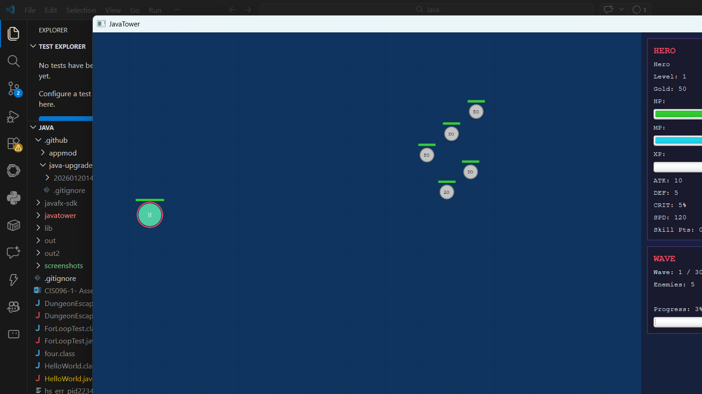
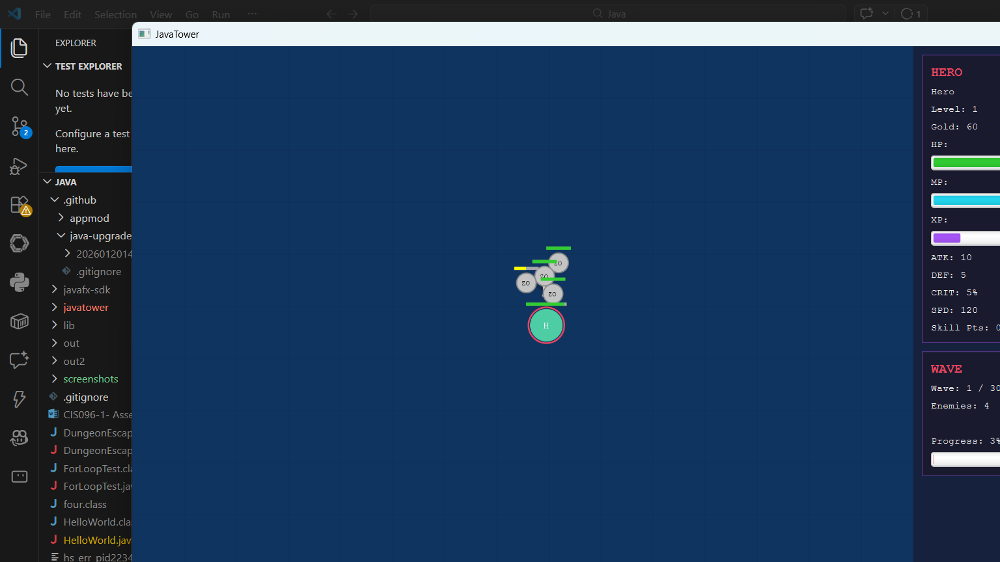
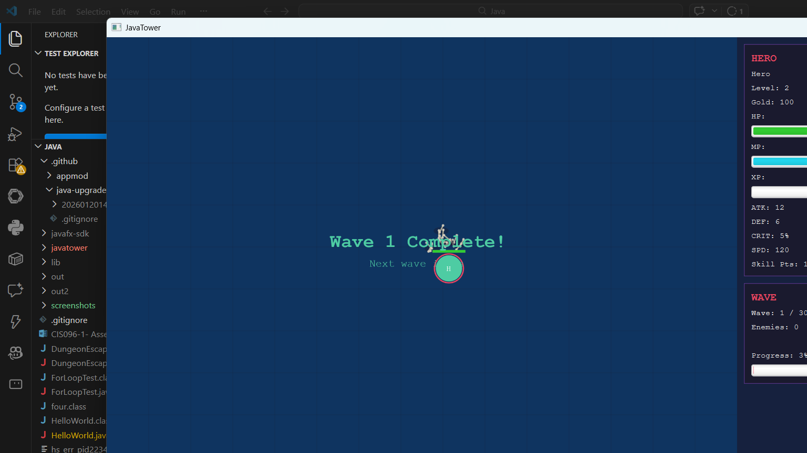
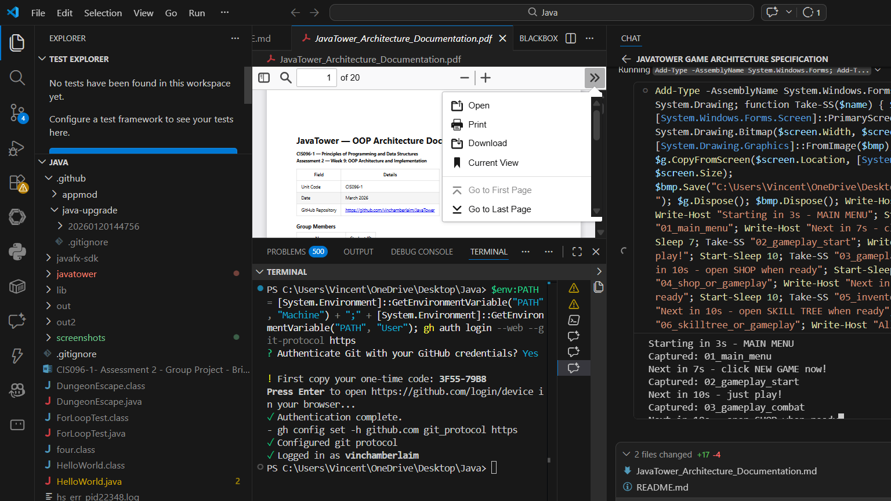
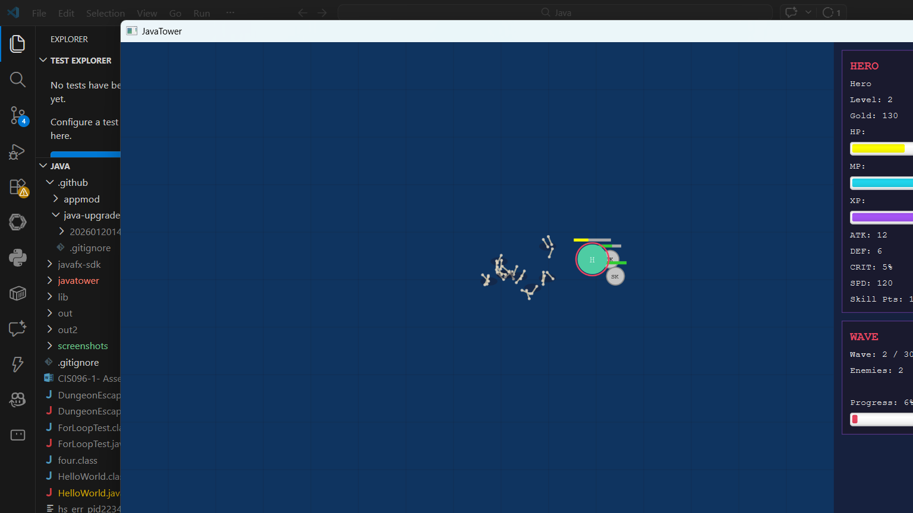
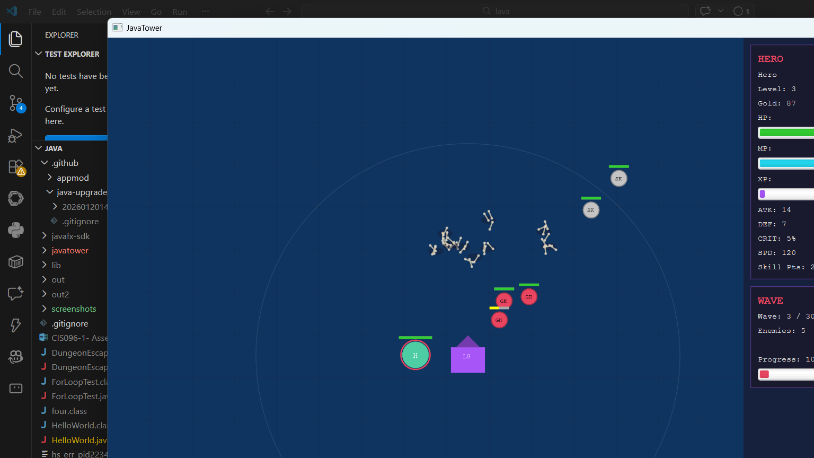

# JavaTower — OOP Architecture Documentation

**CIS096-1 — Principles of Programming and Data Structures**  
**Assessment 2 — Week 9: OOP Architecture and Implementation**

| Field | Details |
|-------|---------|
| Unit Code | CIS096-1 |
| Date | March 2026 |
| GitHub Repository | https://github.com/vinchamberlaim/JavaTower |

### Group Members

| Name | Student ID |
|------|------------|
| Vincent Chamberlain | 2424309 |
| Nicolas Alfaro | 2301126 |
| Emmanuel Adewumi | 2507044 |

---

## Table of Contents

1. [Introduction](#1-introduction)
2. [System Architecture Overview](#2-system-architecture-overview)
3. [Architecture Diagram](#3-architecture-diagram)
4. [Package Structure](#4-package-structure)
5. [Class Definitions](#5-class-definitions)
   - 5.1 [Core Entities](#51-core-entities-javatowerentities)
   - 5.2 [Enemy Subclasses](#52-enemy-subclasses-javatowerentitiesenemies)
   - 5.3 [Tower Subclasses](#53-tower-subclasses-javatowerentitiestowers)
   - 5.4 [Systems](#54-systems-javatowersystems)
   - 5.5 [Factories](#55-factories-javatowerfactories)
   - 5.6 [GUI](#56-gui-javatowergui)
   - 5.7 [Database](#57-database-javatowerdatabase)
   - 5.8 [Utilities](#58-utilities-javatowerutil)
6. [OOP Principles Applied](#6-oop-principles-applied)
7. [Design Patterns](#7-design-patterns)
8. [Class Diagram (UML)](#8-class-diagram-uml)
9. [Database Design](#9-database-design)
10. [GUI Architecture](#10-gui-architecture)
11. [Game Loop and Real-Time Systems](#11-game-loop-and-real-time-systems)
12. [Application Screenshots](#12-application-screenshots)
13. [Testing and Demonstration](#13-testing-and-demonstration)
14. [AI Tool Usage and Reflection](#14-ai-tool-usage-and-reflection)
15. [Conclusion](#15-conclusion)

---

## 1. Introduction

JavaTower is a real-time tower defence RPG implemented in Java 21 using JavaFX for the graphical interface and SQLite (via JDBC) for persistent data storage. The game challenges the player to survive 30 waves of progressively more difficult undead enemies by controlling a hero character, placing defensive towers, managing an inventory of equipment, and upgrading skills.

### Key Features
- **Real-time gameplay** with an `AnimationTimer` game loop running at 60 FPS
- **13 enemy types** across 10 tiers from Zombie to NecromancerKing, each with unique AI behaviours
- **Elite modifier system** that randomly enhances enemies (Swift, Vampiric, Shielded, Splitter, etc.)
- **4 tower types** (Arrow, Magic, Siege, Support) with upgrade paths and tower synergy bonuses
- **Tetris-style inventory** where items have 2D sizes (e.g., a sword is 1×3, chest armour is 2×3)
- **Equipment system** with 8 slots (weapon, offhand, helmet, chest, legs, boots, 2 accessories)
- **Item rarity system** (Common → Legendary) with stat multipliers and equipment set bonuses
- **Forge system** for combining duplicate items into higher-rarity upgrades
- **Bone pile mechanic** where dead enemies leave corpses that bosses can resurrect
- **Skill tree system** with branching prerequisites (combat, magic, utility trees)
- **Use-based skill progression** — weapon proficiency improves through combat
- **Shop system** with wave-scaled stock and buy/sell mechanics
- **Wave modifiers** (Swarm, Elite Wave, Rush, Gold Rush, etc.) for variety each wave
- **Difficulty levels** (Easy, Normal, Hard, Nightmare) with stat scaling
- **SQLite persistence** for saving and loading game state via JDBC with multiple save slots
- **30 hand-crafted waves** with mini-bosses every 5 waves and a final boss at wave 30
- **Mini-map, combat log, pixel art rendering, and visual effects** (projectiles, damage numbers, spell effects)

### Technology Stack
| Component | Technology | Version |
|-----------|-----------|---------|
| Language | Java | 21 (OpenJDK) |
| GUI Framework | JavaFX | 21.0.2 |
| Database | SQLite via JDBC | sqlite-jdbc 3.45.1.0 |
| Build | Manual `javac` with `sources.txt` | — |
| IDE | VS Code with Java Extension Pack | — |

### Why We Chose These Technologies

- **Java 21** — The language we have been learning throughout CIS096-1. Using the latest LTS release gives us access to modern features while keeping compatibility with course material.
- **JavaFX** — We chose JavaFX because it is the GUI framework we have been using in our lessons, so we were already familiar with its layout system (`BorderPane`, `VBox`, `HBox`), event handling, and the `Canvas` class. It fit the bill perfectly for a real-time game because its built-in `AnimationTimer` gives us a proper 60 FPS game loop without needing any external game engine.
- **SQLite via JDBC** — A lightweight embedded database that requires no server setup. The `sqlite-jdbc` JAR is the only dependency, and JDBC is the standard Java database API covered in the course.
- **`javac` (Java Compiler)** — `javac` is the command-line Java compiler that ships with the JDK. It reads `.java` source files and compiles them into `.class` bytecode files that the JVM can execute. We use `javac` directly with a `sources.txt` file (which lists all `.java` files) instead of a build tool like Maven or Gradle because the project is self-contained and does not need complex dependency management — our only external JAR is the SQLite driver.
- **VS Code** — Lightweight editor with the Java Extension Pack providing IntelliSense, debugging, and integrated terminal support.

---

## 2. System Architecture Overview

JavaTower follows a **layered architecture** with clear separation of concerns:

```
┌─────────────────────────────────────────────────────────┐
│                    Presentation Layer                     │
│   GameGUI · GameBoard · HeroPanel · ShopPanel · etc.     │
├─────────────────────────────────────────────────────────┤
│                    Game Logic Layer                       │
│   WaveManager · Shop · Inventory · SkillTree · Combat    │
├─────────────────────────────────────────────────────────┤
│                    Entity Layer                           │
│   Entity → Hero, Enemy (10 subclasses), Tower (4 sub.)   │
│   Item · BonePile                                        │
├─────────────────────────────────────────────────────────┤
│                    Factory Layer                          │
│   EnemyFactory · TowerFactory · ItemFactory              │
├─────────────────────────────────────────────────────────┤
│                    Data / Persistence Layer               │
│   DatabaseManager (SQLite / JDBC)                        │
├─────────────────────────────────────────────────────────┤
│                    Utilities                              │
│   Constants · GameState                                  │
└─────────────────────────────────────────────────────────┘
```

**Data flow:** The `GameGUI` (presentation) orchestrates the game loop. Each frame, it calls `update()` on entities (Hero, Enemies, Towers), which read from `Constants` and interact via the systems layer. Factories create new entities. The `DatabaseManager` persists state to SQLite.

---

## 3. Architecture Diagram

```
                         ┌──────────┐
                         │  Main    │
                         │ (Entry)  │
                         └────┬─────┘
                              │ launches
                              ▼
                    ┌─────────────────────┐
                    │      GameGUI        │ ◄── AnimationTimer (60 FPS)
                    │   (Application)     │
                    └──┬──┬──┬──┬──┬─────┘
                       │  │  │  │  │
          ┌────────────┘  │  │  │  └────────────────┐
          ▼               ▼  │  ▼                   ▼
    ┌──────────┐  ┌──────────┐│┌───────────┐  ┌──────────────┐
    │ GameBoard│  │ HeroPanel│││ ShopPanel  │  │InventoryPanel│
    │ (Canvas) │  │          │││           │  │              │
    └──────────┘  └──────────┘│└───────────┘  └──────────────┘
                              │
              ┌───────────────┼────────────────┐
              ▼               ▼                ▼
        ┌──────────┐   ┌───────────┐    ┌──────────┐
        │   Hero   │   │  Enemies  │    │  Towers  │
        │(Entity)  │   │ (Entity)  │    │ (Entity) │
        └────┬─────┘   └─────┬─────┘    └────┬─────┘
             │               │                │
             ▼               ▼                ▼
    ┌──────────────┐ ┌──────────────┐ ┌──────────────┐
    │  Inventory   │ │ WaveManager  │ │ TowerFactory │
    │  Shop        │ │ EnemyFactory │ │              │
    │  SkillTree   │ │              │ │              │
    └──────────────┘ └──────────────┘ └──────────────┘
             │
             ▼
    ┌──────────────────┐
    │ DatabaseManager  │ ◄── SQLite via JDBC
    │   (Singleton)    │
    └──────────────────┘
```

---

## 4. Package Structure

```
javatower/
├── ai/                            # AI and analytics
│   └── GameMetrics.java           # Per-wave gameplay data collection for balance analysis
│
├── config/                        # Game configuration
│   └── GameBalanceConfig.java     # Centralised balance constants (hero, enemy, economy tuning)
│
├── data/                          # Data transfer objects
│   ├── GameState.java             # Serialisable game state for save/load
│   └── SaveSlotInfo.java          # Save slot metadata for the load-game UI
│
├── database/                      # Data persistence
│   └── DatabaseManager.java       # SQLite JDBC singleton
│
├── entities/                      # Core game entities (OOP hierarchy)
│   ├── Entity.java                # Abstract base class for all entities
│   ├── Hero.java                  # Player character (extends Entity)
│   ├── Enemy.java                 # Abstract enemy base (extends Entity)
│   ├── Tower.java                 # Abstract tower base (extends Entity)
│   ├── Item.java                  # Equipment and consumable items
│   ├── BonePile.java              # Dead enemy corpses for resurrection
│   ├── EliteModifier.java         # Enum of elite buffs (Swift, Vampiric, Shielded, etc.)
│   ├── enemies/                   # Concrete enemy implementations (13 types)
│   │   ├── Zombie.java            # Tier 1 — slow melee
│   │   ├── Skeleton.java          # Tier 2 — ranged
│   │   ├── Ghoul.java             # Tier 3 — fast melee
│   │   ├── Wight.java             # Tier 4 — standard melee
│   │   ├── Wraith.java            # Tier 5 — phasing ranged
│   │   ├── Revenant.java          # Tier 6 — resurrects on death
│   │   ├── DeathKnight.java       # Tier 7 — heavy melee
│   │   ├── Lich.java              # Tier 8 — kiting summoner
│   │   ├── Cultist.java           # Tier 8 — eldritch cult caster
│   │   ├── DeepOne.java           # Tier 9 — amphibious abyssal brute
│   │   ├── BoneColossus.java      # Tier 9 — massive tank
│   │   ├── Shoggoth.java          # Tier 10 — cosmic horror juggernaut
│   │   └── NecromancerKing.java   # Tier 10 — final boss, dual-weapon AI
│   └── towers/                    # Concrete tower implementations
│       ├── ArrowTower.java        # Single-target physical damage
│       ├── MagicTower.java        # AoE magic damage
│       ├── SiegeTower.java        # Slow, high-damage siege
│       └── SupportTower.java      # Buff/support aura
│
├── events/                        # Event-driven communication
│   └── GameEventBus.java          # Observer pattern pub/sub for game events
│
├── factories/                     # Object creation (Factory Pattern)
│   ├── EnemyFactory.java          # Creates enemies with wave scaling and elite modifiers
│   ├── TowerFactory.java          # Creates towers by type
│   └── ItemFactory.java           # Creates items and shop stock
│
├── gui/                           # JavaFX user interface
│   ├── GameGUI.java               # Main application window and game loop
│   ├── GameBoard.java             # Canvas-based game rendering
│   ├── HeroPanel.java             # Hero stats display
│   ├── WaveInfoPanel.java         # Wave progress display
│   ├── ShopPanel.java             # Shop interface
│   ├── InventoryPanel.java        # Inventory management interface
│   ├── SkillTreePanel.java        # Skill tree interface
│   ├── ForgePanel.java            # Item forge/combine interface
│   ├── CombatLogPanel.java        # Recent combat events log
│   ├── MiniMap.java               # Scaled-down world overview overlay
│   ├── PixelArtRenderer.java      # Pixel-art sprite rendering with animations
│   └── VisualEffect.java          # Projectiles, damage numbers, spell effects
│
├── systems/                       # Game systems and mechanics
│   ├── WaveManager.java           # Wave progression and enemy spawning
│   ├── WaveModifier.java          # Per-wave random modifiers (Swarm, Rush, Gold Rush, etc.)
│   ├── Shop.java                  # Buy/sell items between waves
│   ├── Inventory.java             # Tetris-style grid inventory
│   ├── Forge.java                 # Item combining/upgrading system
│   ├── SkillTree.java             # Branching skill progression
│   ├── SkillNode.java             # Individual skill node
│   ├── SkillProgression.java      # Use-based weapon proficiency system
│   ├── CombatSystem.java          # Combat coordination
│   ├── SaveGameManager.java       # Multi-slot save/load orchestration
│   ├── SetBonusManager.java       # Equipment set bonus calculations
│   └── TowerSynergyManager.java   # Adjacent tower synergy bonuses
│
└── util/                          # Configuration and state management
    ├── Constants.java             # Game-wide constants (dimensions, speeds, ranges)
    ├── GameState.java             # State machine enum (MAIN_MENU, PLAYING, etc.)
    ├── Difficulty.java            # Difficulty levels (Easy, Normal, Hard, Nightmare)
    └── Logger.java                # Console and file logging utility
```

**Total:** 62 Java source files across 10 packages.

---

## 5. Class Definitions

### 5.1 Core Entities (`javatower.entities`)

#### `Entity` (Abstract Base Class)

The root of the entity hierarchy. All game objects that exist on the game board extend this class.

| Attribute | Type | Description |
|-----------|------|-------------|
| `name` | `String` | Entity display name |
| `maxHealth` | `int` | Maximum hit points |
| `currentHealth` | `int` | Current hit points |
| `attack` | `int` | Base attack damage |
| `defence` | `int` | Damage reduction |
| `x`, `y` | `double` | Pixel position (continuous for smooth movement) |
| `radius` | `double` | Collision radius in pixels |
| `alive` | `boolean` | Whether the entity is active |

| Method | Description |
|--------|-------------|
| `takeTurn()` | Abstract — called each frame (overridden by subclasses) |
| `takeDamage(int)` | Applies damage reduced by defence (minimum 1); triggers `onDeath()` |
| `heal(int)` | Restores health up to maximum |
| `setPosition(double, double)` | Sets pixel coordinates |
| `distanceTo(Entity)` | Euclidean distance to another entity |
| `distanceTo(double, double)` | Euclidean distance to a point |
| `overlaps(Entity)` | Circle-based collision detection |
| `getHealthPercent()` | Returns health as percentage (for health bars) |
| `onDeath()` | Hook method called when health reaches zero |

**OOP Principle:** Abstraction — `Entity` defines a common interface for all game objects while leaving specific behaviour to subclasses.

---

#### `Hero` (extends `Entity`)

The player-controlled character with equipment, inventory, skills, and real-time AI.

| Attribute | Type | Description |
|-----------|------|-------------|
| `weapon`, `offhand`, `helmet`, `chest`, `legs`, `boots`, `accessory1`, `accessory2` | `Item` | 8 equipment slots |
| `level` | `int` | Current level (starts at 1) |
| `experience` | `int` | Current XP |
| `experienceToNextLevel` | `int` | XP threshold (scales per level) |
| `gold` | `int` | Currency for shop purchases |
| `mana`, `maxMana` | `int` | Resource for abilities |
| `critChance` | `int` | Critical hit percentage |
| `skillPoints` | `int` | Points for unlocking skills |
| `moveSpeed` | `double` | Pixels per second |
| `attackCooldown` | `double` | Seconds between attacks |
| `attackTimer` | `double` | Time accumulator |
| `targetX`, `targetY` | `double` | Click-to-move destination |
| `moving` | `boolean` | Whether hero is moving |
| `inventory` | `Inventory` | Tetris grid inventory (3×3) |
| `combatTree`, `magicTree`, `utilityTree` | `SkillTree` | Three skill branches |

| Key Method | Description |
|------------|-------------|
| `update(double dt, List<Enemy>)` | Per-frame update: smooth movement + auto-attack nearest enemy |
| `moveTo(double, double)` | Sets click-to-move target |
| `attackEnemy(Enemy)` | Deals damage with critical hit chance |
| `gainExperience(int)` | Awards XP and checks for level-up |
| `levelUp()` | Increases stats and grants skill point |
| `equipItem(Item)` | Equips item to the correct slot based on `Item.Slot` |
| `unequipItem(Item.Slot)` | Removes equipped item back to inventory |

**OOP Principle:** Encapsulation — all hero state is private with controlled access through methods.

---

#### `Enemy` (Abstract, extends `Entity`)

Base class for all undead enemies with a built-in type system for 10 tiers.

**Inner Enum — `EnemyType`:**

| Type | Tier | HP | ATK | DEF | XP | Gold | Special |
|------|------|----|-----|-----|----|------|---------|
| ZOMBIE | 1 | 30 | 5 | 2 | 10 | 5 | Slow melee |
| SKELETON | 2 | 25 | 8 | 1 | 15 | 8 | Ranged (150px) |
| GHOUL | 3 | 40 | 7 | 3 | 20 | 12 | Fast melee |
| WIGHT | 4 | 60 | 10 | 5 | 30 | 18 | Standard |
| WRAITH | 5 | 35 | 12 | 2 | 25 | 15 | Phasing, ranged (80px) |
| REVENANT | 6 | 80 | 12 | 8 | 40 | 25 | Self-resurrect, mini-boss |
| DEATH_KNIGHT | 7 | 120 | 15 | 12 | 60 | 40 | Heavy melee |
| LICH | 8 | 70 | 20 | 6 | 80 | 50 | Kiting AI, summoner |
| BONE_COLOSSUS | 9 | 200 | 18 | 15 | 100 | 70 | Massive tank |
| NECROMANCER_KING | 10 | 500 | 30 | 20 | 500 | 200 | Final boss, dual-weapon AI |

| Attribute | Type | Description |
|-----------|------|-------------|
| `type` | `EnemyType` | The enemy's tier and base stats |
| `speed` | `double` | Movement speed (pixels/second) |
| `attackCooldown` | `double` | Seconds between attacks |
| `attackRange` | `double` | Attack reach in pixels |
| `isBoss`, `isMiniBoss` | `boolean` | Boss flags |
| `canPhase`, `canResurrect`, `canSummon` | `boolean` | Special ability flags |
| `siblings` | `List<Enemy>` | Sibling reference for pack behaviour |
| `bonePiles` | `List<BonePile>` | Reference for summoning mechanics |

| Key Method | Description |
|------------|-------------|
| `update(double, Hero, List<Enemy>)` | Abstract real-time AI update |
| `smoothMoveToward(double, double, double, double)` | Movement with collision avoidance |
| `summonFromBones(List<BonePile>)` | Hook for summoner enemies |
| `onDeath()` | Hook for death effects (resurrection, etc.) |

**OOP Principle:** Inheritance and Polymorphism — 10 concrete subclasses override `update()` to implement unique AI behaviours.

---

#### `Tower` (Abstract, extends `Entity`)

Base class for defensive structures placed on the game board.

| Attribute | Type | Description |
|-----------|------|-------------|
| `type` | `TowerType` | ARROW, MAGIC, SIEGE, or SUPPORT |
| `range` | `int` | Abstract range units (×64 = pixels) |
| `damage` | `int` | Base damage per attack |
| `attackCooldown` | `double` | Seconds between attacks |
| `upgradeLevel` | `int` | Current upgrade tier |
| `upgradeCost` | `int` | Gold cost for next upgrade |

| Key Method | Description |
|------------|-------------|
| `update(double, List<Enemy>)` | Per-frame: attacks enemies on cooldown |
| `getRangePixels()` | Converts range to pixel distance |
| `attack(List<Enemy>)` | Abstract — deals damage to enemy/enemies |
| `selectTarget(List<Enemy>)` | Abstract — targeting strategy |
| `upgrade()` | Abstract — improves tower stats |

---

#### `Item`

Represents equipment and consumable items with a Tetris-style 2D size system.

**Inner Enums:**
- `Slot`: WEAPON, OFFHAND, HELMET, CHEST, LEGS, BOOTS, ACCESSORY, CONSUMABLE
- `Rarity`: COMMON (×1.0), UNCOMMON (×1.2), RARE (×1.5), EPIC (×2.0), LEGENDARY (×3.0)

| Attribute | Type | Description |
|-----------|------|-------------|
| `name`, `description` | `String` | Item identity |
| `slot` | `Slot` | Equipment slot category |
| `rarity` | `Rarity` | Rarity with stat multiplier |
| `width`, `height` | `int` | 2D inventory size |
| `statBonuses` | `Map<String, Integer>` | Stat modifications (attack, defence, critChance, etc.) |
| `itemLevel` | `int` | Level scaling factor |
| `buyPrice`, `sellPrice` | `int` | Shop prices |

**Static Factory Methods:** `createSword()`, `createShield()`, `createHelmet()`, `createChestArmor()`, `createRing()`, `createHealthPotion()`, `createManaPotion()`

**Item Sizes (Tetris Grid):**
| Item | Width × Height | Slot |
|------|---------------|------|
| Sword | 1 × 3 | WEAPON |
| Shield | 2 × 2 | OFFHAND |
| Helmet | 2 × 1 | HELMET |
| Chest Armor | 2 × 3 | CHEST |
| Ring | 1 × 1 | ACCESSORY |
| Health/Mana Potion | 1 × 1 | CONSUMABLE |

---

#### `BonePile`

Represents a dead enemy's corpse on the game board. Used by summoner enemies (Lich, NecromancerKing) to resurrect fallen undead.

| Attribute | Type | Description |
|-----------|------|-------------|
| `x`, `y` | `double` | Position on the game board |
| `enemyType` | `EnemyType` | Type of fallen enemy |
| `tier` | `int` | Tier of fallen enemy |
| `used` | `boolean` | Whether this pile has been consumed |

---

#### `EliteModifier` (Enum)

Enemy elite modifiers that grant bonus stats and special traits. Applied randomly at spawn for variety.

| Modifier | Tier | Effect |
|----------|------|--------|
| FAST ("Swift") | Common (30%) | +50% speed, −20% HP |
| TANKY ("Iron") | Common (30%) | +50% HP, −30% speed |
| VAMPIRIC | Uncommon (15%) | +20% HP, heals 20% of damage dealt |
| EXPLOSIVE ("Volatile") | Uncommon (15%) | Explodes on death |
| REGENERATING ("Regen") | Uncommon (15%) | Regenerates HP over time |
| SHIELDED | Rare (5%) | Shield absorbs first hit |
| SPLITTER | Rare (5%) | Splits into 2 smaller enemies on death |

**OOP Principle:** The `EliteModifier` enum uses composition over inheritance — any enemy can receive any modifier without needing a separate subclass for each combination.

---

### 5.2 Enemy Subclasses (`javatower.entities.enemies`)

Each enemy overrides `update()` with unique AI behaviour:

| Class | Tier | AI Behaviour |
|-------|------|-------------|
| `Zombie` | 1 | Direct melee chase — slow, relentless |
| `Skeleton` | 2 | Ranged attacker — maintains distance, shoots from 150px |
| `Ghoul` | 3 | Fast melee — rushes hero, high speed |
| `Wight` | 4 | Standard melee — balanced stats |
| `Wraith` | 5 | Phasing ranged — phases through obstacles, ranged attack at 80px |
| `Revenant` | 6 | Self-resurrect — comes back once after death, mini-boss |
| `DeathKnight` | 7 | Heavy melee — slow but extremely durable |
| `Lich` | 8 | Kiting summoner — maintains 200px distance, flees within 100px, summons from bone piles, ranged attack at 1.8s cooldown |
| `Cultist` | 8 | Eldritch cult caster — ranged magic attacks |
| `DeepOne` | 9 | Amphibious abyssal brute — heavy melee with high HP |
| `BoneColossus` | 9 | Massive tank — very slow, enormous HP and defence |
| `Shoggoth` | 10 | Cosmic horror juggernaut — unstable, high damage and HP |
| `NecromancerKing` | 10 | **Final boss** — dual-weapon system (sword melee 0–50px at 1.5× damage, bow ranged 80–260px at 0.7× damage), dead zone 50–80px, kiting AI, summoning, enrage at 25% HP |

**OOP Principle:** Polymorphism — all 13 enemies share the `Enemy` interface but each exhibits radically different behaviour when `update()` is called.

---

### 5.3 Tower Subclasses (`javatower.entities.towers`)

| Class | Type | Behaviour |
|-------|------|-----------|
| `ArrowTower` | ARROW | Targets nearest enemy, single-target physical damage, fast fire rate |
| `MagicTower` | MAGIC | Area-of-effect magic damage, targets clusters |
| `SiegeTower` | SIEGE | Slow fire rate, massive single-target damage, long range |
| `SupportTower` | SUPPORT | Buffs nearby towers and hero with aura effects |

Each implements `attack()`, `selectTarget()`, and `upgrade()` with distinct strategies.

---

### 5.4 Systems (`javatower.systems`)

#### `Inventory`

A **Tetris-style** grid inventory where items occupy multiple cells based on their `width × height`.

| Attribute | Type | Description |
|-----------|------|-------------|
| `width`, `height` | `int` | Grid dimensions (starts 3×3) |
| `occupied` | `boolean[][]` | Cell occupancy map |
| `itemGrid` | `Item[][]` | Maps cells to items |
| `items` | `List<Item>` | Fast item list |

| Key Method | Description |
|------------|-------------|
| `canPlaceItem(Item, int, int)` | Checks if an item fits at position |
| `addItem(Item)` | Auto-finds first available placement |
| `addItemAt(Item, int, int)` | Places item at specific grid position |
| `removeItem(int, int)` | Removes item occupying the given cell |
| `expand()` | Increases grid size (progression reward) |

#### `WaveManager`

Manages the progression through 30 waves with boss encounters.

| Key Method | Description |
|------------|-------------|
| `startWave()` | Spawns enemies for current wave, flags boss waves |
| `spawnEnemies()` | Delegates to `EnemyFactory` for wave composition |
| `onEnemyKilled(Enemy)` | Tracks kill count for wave completion |
| `isWaveComplete()` | Returns true when all enemies defeated |
| `advanceWave()` | Increments wave counter |

#### `Shop`

Handles buying and selling items between waves.

| Key Method | Description |
|------------|-------------|
| `refreshStock(int)` | Generates new items via `ItemFactory` scaled to wave level |
| `buyItem(Hero, Item)` | Purchases item if hero has enough gold |
| `sellItem(Hero, Item)` | Removes item and refunds gold |
| `getAffordableItems(int)` | Filters shop stock by hero's gold |

#### `SkillTree` and `SkillNode`

A branching skill progression system with three trees (combat, magic, utility).

`SkillNode` attributes: `id`, `name`, `description`, `branch`, `cost`, `prerequisites` (list of node IDs), `bonuses` (stat map), `specialEffect` (Runnable).

`SkillTree` manages a list of nodes and validates prerequisite chains before unlocking.

#### `CombatSystem`

Legacy class retained for compatibility. Real-time combat is now handled directly by `Hero.update()`, `Enemy.update()`, and `Tower.update()` within the `AnimationTimer` game loop.

#### `Forge`

Item crafting system that combines two items of the same rarity into a higher-rarity item.

| Key Method | Description |
|------------|-------------|
| `canForge(Item, Item)` | Checks if two items are compatible for forging (same rarity) |
| `forge(Item, Item)` | Combines items into a higher-rarity result with boosted stats |
| `getForgeResult(Item, Item)` | Preview the result without consuming items |

#### `SaveGameManager`

Multi-slot save/load system supporting multiple save files.

| Key Method | Description |
|------------|-------------|
| `saveToSlot(int, Hero, int)` | Saves current game state to a numbered slot |
| `loadFromSlot(int)` | Restores game state from a save slot |
| `getSlotInfos()` | Returns `SaveSlotInfo` list for the save/load UI |
| `deleteSlot(int)` | Removes a save file |

#### `SetBonusManager`

Tracks equipped item sets and applies bonuses when enough pieces of a set are worn.

| Key Method | Description |
|------------|-------------|
| `checkSetBonuses(Hero)` | Evaluates equipped items against set definitions |
| `getActiveBonuses()` | Returns currently active set bonuses |

#### `SkillProgression`

Use-based weapon experience system — heroes gain proficiency the more they use a weapon type.

| Key Method | Description |
|------------|-------------|
| `addWeaponXP(String, int)` | Awards XP to a weapon type from use |
| `getWeaponLevel(String)` | Returns current level for a weapon type |
| `getBonus(String)` | Returns damage bonus from weapon proficiency |

#### `TowerSynergyManager`

Detects adjacent tower combinations and grants synergy bonuses.

| Synergy | Towers | Effect |
|---------|--------|--------|
| Arcane Arrows | Arrow + Magic | Arrows gain magic damage |
| Fortified Siege | Siege + Support | Siege gains armour-piercing |
| Elemental Storm | Magic + Siege | AoE damage boost |

#### `WaveModifier` (Enum)

Modifies wave behaviour for additional challenge and variety.

| Modifier | Effect |
|----------|--------|
| SWARM | Double enemy count, half HP |
| ELITE_WAVE | All enemies gain elite modifiers |
| RUSH | Enemies spawn faster |
| ARMORED | All enemies gain +50% defence |
| GOLD_RUSH | Enemies drop bonus gold |
| XP_BOOST | Enemies grant bonus XP |

---

### 5.5 Factories (`javatower.factories`)

All factories follow the **Factory Method** design pattern.

#### `EnemyFactory`

| Static Method | Description |
|---------------|-------------|
| `createWaveEnemies(int wave)` | Returns hand-crafted enemy list for waves 1–29 |
| `createMiniBoss(int wave)` | Creates a mini-boss for boss waves (5, 10, 15, 20, 25) |
| `createFinalBoss()` | Creates the NecromancerKing for wave 30 |

Enemy compositions are hand-designed per wave (not random), ensuring difficulty progression:
- Waves 1–4: Basic enemies (Zombie, Skeleton, Ghoul)
- Waves 5–9: Mid-tier with mini-boss (Wight, Wraith)
- Waves 10–14: Advanced enemies (Revenant, DeathKnight)
- Waves 15–24: Elite encounters (Lich, BoneColossus)
- Waves 25–29: Mixed elite waves
- Wave 30: Final boss — NecromancerKing

#### `TowerFactory`

Creates tower instances by `TowerType` with appropriate stats and costs.

#### `ItemFactory`

| Static Method | Description |
|---------------|-------------|
| `generateShopStock(int wave, int count)` | Creates random items scaled to wave level |
| `createRandomItem(int level)` | Generates a random equipment piece with rarity roll |

---

### 5.6 GUI (`javatower.gui`)

#### `GameGUI` (extends `Application`)

The main JavaFX application. Manages:
- **Scene management:** Main menu, game view, shop overlay, inventory overlay, skill tree overlay
- **Game loop:** `AnimationTimer` with delta-time calculation
- **Input handling:** Click-to-move, tower placement mode
- **State transitions:** `GameState` enum drives which UI is active
- **Wave progression:** Automatic wave advancement with delay timer

#### `GameBoard` (extends `Canvas`)

Pixel-based rendering of the game world:
- Grid lines, bone piles (skull icon for tier ≥ 5), tower range circles
- Entity rendering with health bars and tier-based colour coding
- Click handlers for hero movement and tower placement

#### UI Panels

| Panel | Purpose |
|-------|---------|
| `HeroPanel` | Displays hero stats (HP, ATK, DEF, level, gold, mana) |
| `WaveInfoPanel` | Shows current wave, enemies remaining |
| `ShopPanel` | Buy/sell interface between waves |
| `InventoryPanel` | Item management and equipment |
| `SkillTreePanel` | Skill tree interaction |
| `ForgePanel` | UI for combining items via the Forge system |
| `CombatLogPanel` | Scrolling log of recent combat events (damage, kills, loot) |
| `MiniMap` | Scaled overview of the game world showing entity positions |

#### Visual Systems

| Class | Purpose |
|-------|---------|
| `PixelArtRenderer` | Sprite rendering utilities for pixel-art style entities |
| `VisualEffect` | Animated effects: projectiles, damage numbers, spell impacts, screen shake |

---

### 5.7 Database (`javatower.database`)

#### `DatabaseManager` (Singleton)

Provides SQLite persistence via JDBC for save/load functionality.

**Tables:**

| Table | Purpose | Key Columns |
|-------|---------|------------|
| `save_state` | Current game save | hero stats, position, wave number, timestamp |
| `meta_progression` | Cross-run unlocks | unlocked items, skill unlocks, max wave reached |

| Key Method | Description |
|------------|-------------|
| `getInstance()` | Returns the singleton instance |
| `initialize()` | Creates tables if not exist |
| `saveGame(Hero, int)` | Persists hero state and wave number |
| `loadGame()` | Restores hero from saved state |

**OOP Principle:** Singleton pattern ensures a single database connection throughout the application lifecycle.

---

### 5.8 AI and Analytics (`javatower.ai`)

#### `GameMetrics`

Collects per-wave analytics: enemies killed, damage dealt/taken, gold earned, tower efficiency. Used for balancing and post-game stats display.

---

### 5.9 Configuration (`javatower.config`)

#### `GameBalanceConfig`

Centralised tuning file for game balance values — enemy scaling factors, tower costs, XP curves, gold rewards. Separates design data from game logic for easy tweaking.

---

### 5.10 Data Transfer (`javatower.data`)

#### `GameState` (Data Class)

Serializable snapshot of the full game state used by the save/load system.

#### `SaveSlotInfo`

Lightweight data class holding metadata for the save-slot selection UI: slot number, hero name, level, wave reached, timestamp.

---

### 5.11 Events (`javatower.events`)

#### `GameEventBus`

Generic publish/subscribe event system. Game systems register listeners for events (enemy killed, wave started, item dropped) without direct coupling.

| Key Method | Description |
|------------|-------------|
| `subscribe(EventType, Listener)` | Register a listener for an event type |
| `publish(EventType, Object)` | Fire an event to all registered listeners |

**OOP Principle:** Observer pattern — decouples event producers from consumers, enabling modular system communication.

---

### 5.12 Utilities (`javatower.util`)

#### `Constants`

Centralises all magic numbers as `public static final` constants:

| Category | Constants |
|----------|----------|
| Screen | `SCREEN_WIDTH` (960), `SCREEN_HEIGHT` (640) |
| Grid | `TILE_COLS` (15), `TILE_ROWS` (10), `TILE_SIZE` (64px) |
| Entity Sizes | `HERO_RADIUS` (20px), `ENEMY_RADIUS_SMALL/MEDIUM/LARGE/BOSS` |
| Speeds | `HERO_SPEED` (120 px/s), `ENEMY_SPEED_SLOW/NORMAL/FAST` |
| Combat | `MELEE_RANGE` (40px), `TOWER_RANGE_UNIT` (64px) |
| Economy | `STARTING_GOLD` (50), `MAX_WAVES` (30), `WAVE_DELAY` (3.0s) |

#### `GameState` (Enum)

State machine for the application: `MAIN_MENU`, `PLAYING`, `SHOPPING`, `SKILL_TREE`, `PAUSED`, `GAME_OVER`, `VICTORY`.

#### `Difficulty` (Enum)

Difficulty presets that scale enemy stats:

| Difficulty | HP Multiplier | Damage Multiplier | Gold Multiplier |
|------------|--------------|-------------------|----------------|
| EASY | 0.7× | 0.7× | 1.3× |
| NORMAL | 1.0× | 1.0× | 1.0× |
| HARD | 1.4× | 1.3× | 0.8× |
| NIGHTMARE | 2.0× | 1.6× | 0.6× |

#### `Logger`

Dual-output logging utility — writes to both console and a log file. Supports log levels (INFO, WARNING, ERROR) for debugging and diagnostics.

---

## 6. OOP Principles Applied

### Encapsulation
- All entity fields are `private` with getter/setter access
- `Inventory` hides the 2D grid algorithms behind simple `addItem()`/`removeItem()` methods
- `DatabaseManager` encapsulates all SQL operations behind clean Java methods
- `Hero` equipment managed internally — external code only calls `equipItem()`

### Inheritance
- `Entity` → `Hero`, `Enemy`, `Tower` hierarchy provides shared state and behaviour
- `Enemy` → 13 concrete subclasses, each specialising AI behaviour
- `Tower` → 4 concrete subclasses with different attack strategies

**Inheritance Hierarchy:**
```
Entity (abstract)
├── Hero
├── Enemy (abstract)
│   ├── Zombie
│   ├── Skeleton
│   ├── Ghoul
│   ├── Wight
│   ├── Wraith
│   ├── Revenant
│   ├── DeathKnight
│   ├── Lich
│   ├── Cultist
│   ├── DeepOne
│   ├── BoneColossus
│   ├── Shoggoth
│   └── NecromancerKing
└── Tower (abstract)
    ├── ArrowTower
    ├── MagicTower
    ├── SiegeTower
    └── SupportTower
```

### Polymorphism
- `Enemy.update()` — each subclass implements unique AI (kiting, summoning, phasing, resurrecting)
- `Tower.attack()` / `Tower.selectTarget()` — each tower type has a different targeting and damage strategy
- `Entity.takeDamage()` — can be overridden by subclasses for special damage handling
- `Entity.onDeath()` — hook method overridden for bone pile creation, resurrection, etc.

### Abstraction
- `Entity` defines what all game objects *can do* without specifying *how*
- `Tower.attack()` and `Tower.selectTarget()` are abstract, forcing subclasses to define behaviour
- `GameState` enum abstracts application states into a finite state machine
- Factory classes abstract the creation complexity behind simple static methods

---

## 7. Design Patterns

### Factory Method Pattern
**Used in:** `EnemyFactory`, `TowerFactory`, `ItemFactory`

Centralises object creation, allowing wave-specific enemy compositions and randomised items without exposing construction logic to the caller.

```java
// Client code doesn't need to know which concrete Enemy to create
List<Enemy> wave = EnemyFactory.createWaveEnemies(currentWave);
```

### Singleton Pattern
**Used in:** `DatabaseManager`

Ensures a single database connection is shared across the entire application:

```java
DatabaseManager.getInstance().saveGame(hero, waveNumber);
```

### Template Method Pattern
**Used in:** `Entity.takeDamage()` → `onDeath()`

The `takeDamage()` method defines the algorithm (reduce HP, check death), and subclasses hook into `onDeath()` for custom behaviour (bone pile spawning, resurrection).

### State Pattern (Implicit)
**Used in:** `GameState` enum + `GameGUI`

The application behaviour changes based on `GameState`: `PLAYING` runs the game loop, `SHOPPING` pauses gameplay and shows the shop, etc.

### Strategy Pattern (Implicit)
**Used in:** `Tower` subclasses

Each tower implements a different targeting and attack strategy through polymorphic `selectTarget()` and `attack()` methods.

### Observer Pattern
**Used in:** `GameEventBus`, `WaveManager.onEnemyKilled()`

The `GameEventBus` implements a full publish/subscribe system — game systems subscribe to event types (enemy killed, wave started, item dropped) and are notified without direct coupling. `WaveManager` also uses this pattern to update wave progress, spawn bone piles, and award XP/gold on enemy deaths.

---

## 8. Class Diagram (UML)

```
┌─────────────────────────────────────────────────────────┐
│                      <<abstract>>                        │
│                        Entity                            │
├─────────────────────────────────────────────────────────┤
│ - name: String                                           │
│ - maxHealth, currentHealth: int                          │
│ - attack, defence: int                                   │
│ - x, y: double                                           │
│ - radius: double                                         │
│ - alive: boolean                                         │
├─────────────────────────────────────────────────────────┤
│ + takeTurn(): void {abstract}                            │
│ + takeDamage(int): int                                   │
│ + heal(int): void                                        │
│ + distanceTo(Entity): double                             │
│ + overlaps(Entity): boolean                              │
│ + onDeath(): void                                        │
└──────────────┬───────────────┬───────────────┬──────────┘
               │               │               │
      ┌────────▼──┐    ┌──────▼──────┐   ┌────▼────────┐
      │   Hero    │    │   <<abs>>   │   │   <<abs>>   │
      │           │    │   Enemy     │   │   Tower     │
      ├───────────┤    ├─────────────┤   ├─────────────┤
      │ -weapon   │    │ -type       │   │ -type       │
      │ -offhand  │    │ -speed      │   │ -range      │
      │ -helmet   │    │ -attackRange│   │ -damage     │
      │ -chest    │    │ -isBoss     │   │ -cooldown   │
      │ -legs     │    │ -canSummon  │   │ -upgradeL.  │
      │ -boots    │    │ -canPhase   │   ├─────────────┤
      │ -acc1,2   │    │ -bonePiles  │   │ +attack()   │
      │ -level    │    ├─────────────┤   │ +selectT.() │
      │ -gold     │    │ +update()   │   │ +upgrade()  │
      │ -inventory│    │ +summon()   │   └──────┬──────┘
      │ -skillTree│    └──────┬──────┘          │
      ├───────────┤           │           ┌─────┴──────┐
      │ +update() │     ┌─────┴─────┐     │ArrowTower  │
      │ +moveTo() │     │ Zombie    │     │MagicTower  │
      │ +equip()  │     │ Skeleton  │     │SiegeTower  │
      │ +levelUp()│     │ Ghoul     │     │SupportTower│
      └───────────┘     │ Wight     │     └────────────┘
            │           │ Wraith    │
            │           │ Revenant  │
     ┌──────▼──────┐    │ DeathKn.  │
     │  Inventory  │    │ Lich      │
     ├─────────────┤    │ Cultist   │
     │ -width,height│   │ DeepOne   │
     │ -occupied[][] │  │ BoneColo. │
     │ -itemGrid[][] │  │ Shoggoth  │
     ├─────────────┤    │ NecroKing │
     │ +addItem()  │    └───────────┘
     │ +removeItem()│
     │ +canPlace() │        ┌───────────┐
     │ +expand()   │        │   Item    │
     └─────────────┘        ├───────────┤
                            │ -width,h  │
                            │ -statMap  │
    ┌────────────────┐      │ -level    │
    │DatabaseManager │      └───────────┘
    │  <<singleton>> │
    ├────────────────┤      ┌───────────┐
    │ -instance      │      │ BonePile  │
    │ -connection    │      ├───────────┤
    ├────────────────┤      │ -x, y     │
    │ +getInstance() │      │ -enemyType│
    │ +saveGame()    │      │ -used     │
    │ +loadGame()    │      └───────────┘
    └────────────────┘
```

---

## 9. Database Design

JavaTower uses **SQLite** via **JDBC** (`sqlite-jdbc-3.45.1.0.jar`) for persistent storage.

### Entity-Relationship

```
┌──────────────────────────────┐     ┌──────────────────────────────┐
│         save_state           │     │      meta_progression        │
├──────────────────────────────┤     ├──────────────────────────────┤
│ id (PK)        INTEGER       │     │ id (PK)        INTEGER       │
│ hero_name      TEXT          │     │ unlocked_items TEXT           │
│ hero_level     INT           │     │ skill_unlocks  TEXT           │
│ hero_hp        INT           │     │ max_wave       INT           │
│ hero_max_hp    INT           │     │ total_gold     INT           │
│ hero_attack    INT           │     │ inventory_width INT          │
│ hero_defence   INT           │     │ inventory_height INT         │
│ hero_gold      INT           │     └──────────────────────────────┘
│ hero_mana      INT           │
│ hero_max_mana  INT           │
│ hero_exp       INT           │
│ hero_x         INT           │
│ hero_y         INT           │
│ wave           INT           │
│ timestamp      DATETIME      │
└──────────────────────────────┘
```

### JDBC Connection Example
```java
// Singleton initialisation
connection = DriverManager.getConnection("jdbc:sqlite:javatower.db");

// Parameterised query (prevents SQL injection)
PreparedStatement ps = connection.prepareStatement(
    "INSERT OR REPLACE INTO save_state (id, hero_name, ...) VALUES (1, ?, ?, ...)");
ps.setString(1, hero.getName());
ps.setInt(2, hero.getLevel());
ps.executeUpdate();
```

---

## 10. GUI Architecture

The JavaFX GUI is built around a `BorderPane` layout:

```
┌────────────────────────────────────────────────────┐
│                  WaveInfoPanel (Top)                │
├──────────────────────────────────┬─────────────────┤
│                                  │                 │
│          GameBoard               │   HeroPanel     │
│         (Canvas)                 │   (Right)       │
│     960 × 640 pixels             │                 │
│                                  │  - HP bar       │
│   Renders:                       │  - Stats        │
│   - Grid lines                   │  - Level/XP     │
│   - Hero (blue circle)           │  - Gold         │
│   - Enemies (colour by tier)     │  - Equipment    │
│   - Towers (coloured squares)    │                 │
│   - Bone piles (gray/skull)      │                 │
│   - Health bars                  │                 │
│   - Tower range indicators       │                 │
│                                  │                 │
├──────────────────────────────────┴─────────────────┤
│               Tower Buttons (Bottom)                │
│          [Arrow] [Magic] [Siege] [Support]          │
│            [Shop] [Inventory] [Skills]              │
└────────────────────────────────────────────────────┘
```

**Overlay Screens** (pause game loop when open):
- `ShopPanel` — displayed between waves, buy/sell items
- `InventoryPanel` — manage equipment and items
- `SkillTreePanel` — spend skill points on upgrades
- `ForgePanel` — combine items into higher-rarity gear

---

## 11. Game Loop and Real-Time Systems

The game uses JavaFX `AnimationTimer` for a real-time game loop:

```java
gameLoop = new AnimationTimer() {
    @Override
    public void handle(long now) {
        double dt = (now - lastNanoTime) / 1_000_000_000.0;  // Delta time in seconds
        lastNanoTime = now;

        hero.update(dt, enemies);           // Hero movement & auto-attack
        for (Enemy e : enemies)
            e.update(dt, hero, enemies);    // Enemy AI
        for (Tower t : towers)
            t.update(dt, enemies);          // Tower auto-attack

        checkDeaths();                      // Clean up dead entities, spawn bone piles
        checkWaveCompletion();              // Advance waves
        gameBoard.render(hero, enemies,     // Redraw everything
                         towers, bonePiles);
    }
};
```

**Delta-time system** ensures consistent gameplay speed regardless of frame rate:
- Movement: `newPos = oldPos + speed * dt`
- Attack cooldowns: `timer += dt; if (timer >= cooldown) { attack(); timer = 0; }`

---

## 12. Application Screenshots

The following screenshots demonstrate the working application:

### Main Menu

*The main menu screen with New Game, Load Game, and Quit options.*

### Gameplay — Wave Start

*The game board showing the hero, grid, tower placement buttons, and HUD panels.*

### Gameplay — Combat

*Real-time combat with enemies approaching the hero, health bars visible.*

### Shop / Gameplay

*The shop interface or continued gameplay showing wave progression.*

### Inventory

*The inventory management screen or gameplay with towers placed.*

### Skill Tree / Additional Gameplay

*The skill tree interface or late-game combat.*

---

## 13. Testing and Demonstration

### Functional Testing

The following core features have been tested through gameplay demonstration:

| Feature | Test | Status |
|---------|------|--------|
| Hero movement | Click-to-move across the game board | ✓ Working |
| Hero auto-attack | Hero attacks nearest enemy in melee range | ✓ Working |
| Enemy AI | Each enemy type exhibits unique behaviour | ✓ Working |
| Tower placement | Click tower button, then click grid cell | ✓ Working |
| Tower attacks | Towers auto-attack enemies within range | ✓ Working |
| Wave progression | 30 waves with auto-advance | ✓ Working |
| Boss encounters | Mini-bosses at waves 5/10/15/20/25, final boss at 30 | ✓ Working |
| Bone pile system | Dead enemies leave corpses; summoners resurrect them | ✓ Working |
| Shop buy/sell | Purchase and sell items between waves | ✓ Working |
| Inventory grid | Tetris-style item placement and removal | ✓ Working |
| Equipment system | 8 equipment slots with item types | ✓ Working |
| Level/XP system | Hero gains XP from kills, levels up with stat increases | ✓ Working |
| Database save/load | SQLite persistence of hero state | ✓ Working |
| NecromancerKing AI | Dual-weapon kiting boss with summoning and enrage | ✓ Working |
| Lich kiting AI | Maintains distance, flees when too close, summons | ✓ Working |

### Compilation Verification

The project compiles cleanly with zero errors:
```
javac --module-path "javafx-sdk/lib" --add-modules javafx.controls,javafx.graphics \
      -cp "lib/sqlite-jdbc-3.45.1.0.jar" -d out2 @sources.txt
```

### Runtime Verification

The application launches and runs all 30 waves without crashes:
```
java --module-path "javafx-sdk/lib" --add-modules javafx.controls,javafx.graphics \
     -cp "out2;lib/sqlite-jdbc-3.45.1.0.jar" Main
```

---

## 14. AI Tool Usage and Reflection

### Tools Used
- **GitHub Copilot** — Assisted with code generation, debugging, and architecture documentation
- **VS Code** — Primary IDE with Java Extension Pack

### How AI Helped
- **Code scaffolding:** Copilot generated boilerplate for entity classes and factory methods, saving significant time on repetitive code
- **Debugging:** AI helped identify issues such as the `double` to `int` cast in `DatabaseManager.saveGame()` for hero position coordinates
- **Architecture planning:** AI assisted in structuring the package hierarchy and identifying appropriate design patterns
- **Documentation:** AI helped create comprehensive class descriptions and diagrams

### Challenges Without AI
- Understanding the interaction between JavaFX's `AnimationTimer` and real-time game logic would have required more trial and error
- Designing the Tetris-style inventory algorithm (2D bin packing) was conceptually challenging
- Balancing 13 enemy tiers with unique AI behaviors across 30 waves would have taken significantly longer

### What I Learned
- How to structure a large Java project with proper package separation
- How to implement real-time game loops with delta-time
- How `abstract` classes and `polymorphism` enable extensible enemy/tower systems
- How JDBC connects Java applications to SQLite databases
- The importance of the Factory pattern for managing complex object creation

---

## 15. Conclusion

JavaTower demonstrates comprehensive application of Object-Oriented Programming principles through a real-time tower defence RPG with 62 Java source files across 10 packages. The project features:

- A deep **inheritance hierarchy** (Entity → Hero/Enemy/Tower with 17 subclasses)
- Effective use of **polymorphism** for diverse enemy AI and tower behaviour
- Strong **encapsulation** across all classes with private fields and controlled access
- Proper **abstraction** through abstract base classes and interfaces
- **Design patterns** including Factory Method, Singleton, Template Method, Observer, and State
- **JDBC database connectivity** for persistent game saves
- A **JavaFX GUI** with real-time canvas rendering and multiple interactive panels
- **Elite modifiers**, **forge crafting**, **set bonuses**, **tower synergies**, and **difficulty scaling**

The codebase is organised, documented, and fully functional — compiling and running cleanly on Java 21 with JavaFX 21.0.2 and SQLite JDBC 3.45.1.0.

---

*This document was prepared for the CIS096-1 Week 9 submission — OOP Architecture and Implementation.*
