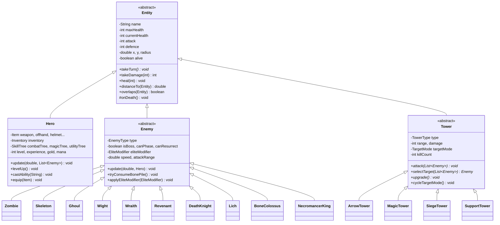
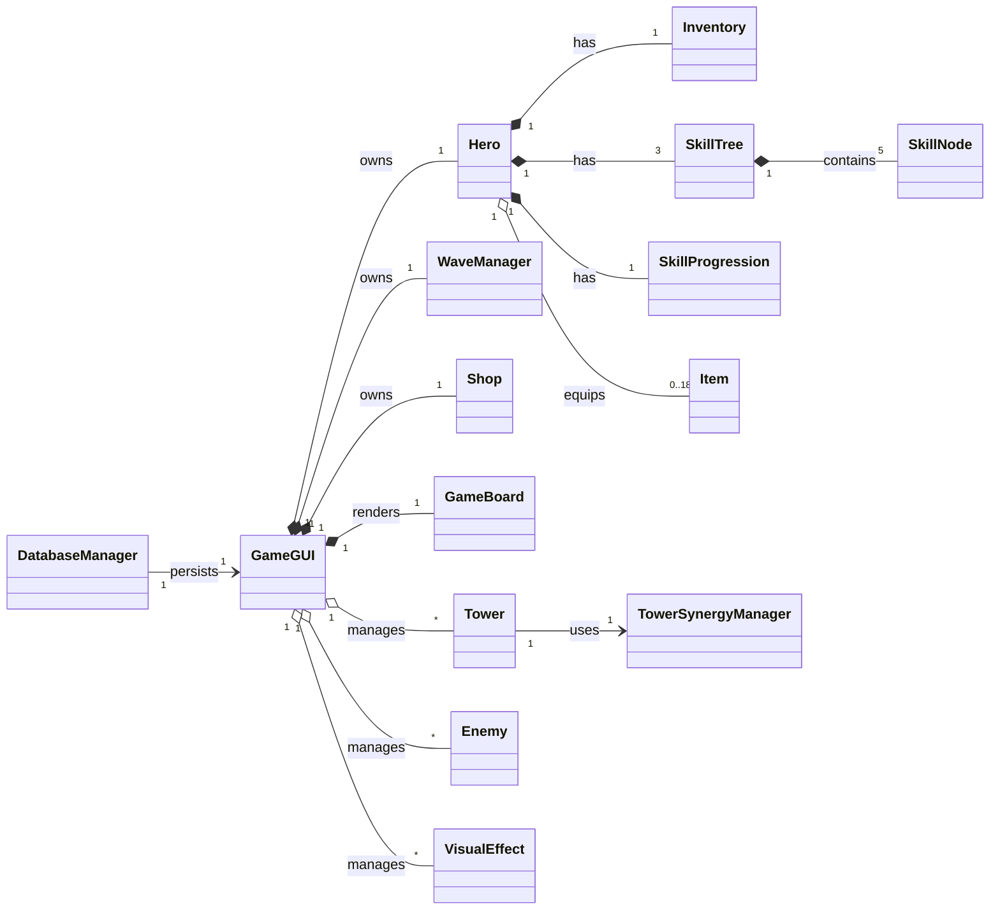
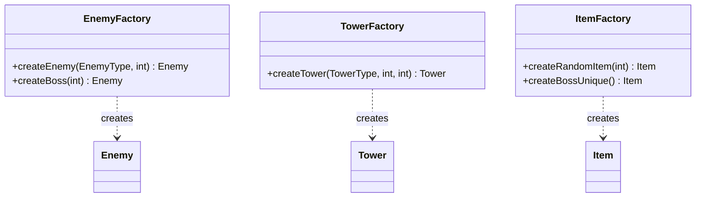
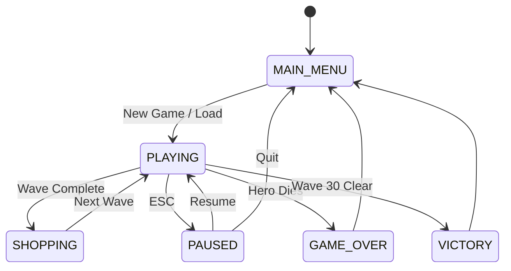
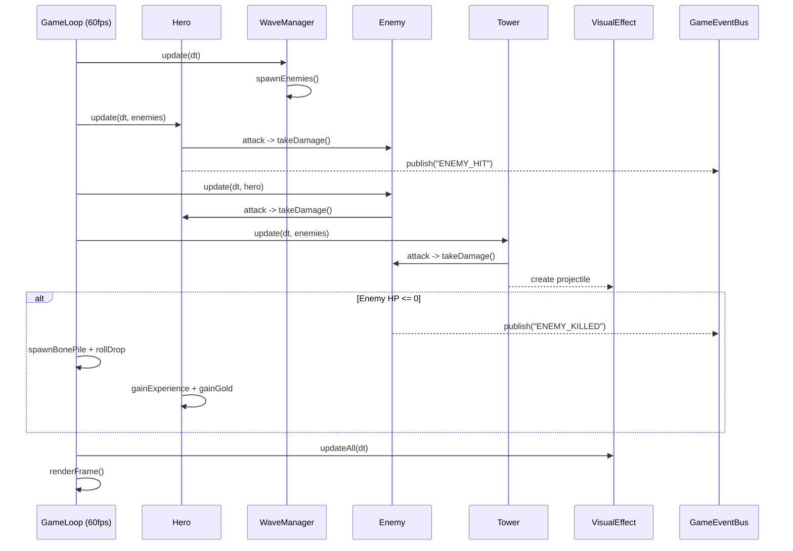
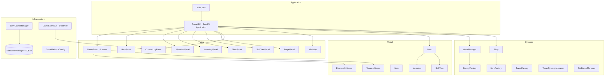

# JavaTower - Tower Defence RPG

**CIS096-1 - Principles of Programming and Data Structures**
**Assessment 2 - OOP Architecture & Implementation (Week 9)**

| Field | Details |
|-------|---------|
| Unit Code | CIS096-1 |
| Assessment | 2 - OOP Architecture & Implementation |
| Submission | Week 9 |
| Language | Java 21, JavaFX 21.0.2, SQLite JDBC 3.45.1.0 |
| Repository | [github.com/vinchamberlaim/JavaTower](https://github.com/vinchamberlaim/JavaTower) |

### Group Members

| Name | Student ID | Role |
|------|------------|------|
| Vincent Chamberlain | 2424309 | Core systems, GUI, game loop |
| Nicolas Alfaro | 2301126 | Enemy AI, towers, combat |
| Emmanuel Adewumi | 2507044 | Items, inventory, database |

---

## Table of Contents

1. [Overview](#overview)
2. [Quick Start](#quick-start)
3. [Prerequisites](#prerequisites)
4. [Project Structure](#project-structure)
5. [UML Class Diagram](#uml-class-diagram)
6. [OOP Principles Demonstrated](#oop-principles-demonstrated)
7. [Design Patterns](#design-patterns)
8. [Data Structures](#data-structures)
9. [System Architecture](#system-architecture)
10. [Game Mechanics](#game-mechanics)
11. [Controls](#controls)
12. [Documentation](#documentation)

---

## Overview

**JavaTower** is a real-time tower defence RPG built with Java 21 and JavaFX. The player controls a hero navigating through 30 waves of undead enemies, placing defensive towers, managing a Tetris-style grid inventory, purchasing equipment from a shop, forging items, and progressing through branching skill trees. Game state persists via SQLite (JDBC).

### Key Features

- **Real-time combat** - hero fights alongside towers at 60 FPS
- **10 enemy types** with tiered progression (Zombie to Necromancer King)
- **4 tower types** with proximity-based synergy bonuses
- **Tetris-style inventory** with grid-based item placement
- **Equipment sets** (Holy, Death, Fire, Knight) with 2pc/4pc bonuses
- **Branching skill trees** (Combat, Magic, Utility) with prerequisites
- **Item forge** - combine two identical items to upgrade rarity
- **Elite modifiers** - random buffs on enemies (Fast, Tanky, Vampiric, etc.)
- **Wave modifiers** - global effects per wave (Swarm, Rush, Darkness, etc.)
- **SQLite persistence** - save/load across 4 slots
- **Observer event bus** - decoupled game event system

---

## Quick Start

### Option 1: One-Click Launch (Recommended)

Double-click **RunJavaTower.bat** - it automatically:

1. Checks for Java 21+
2. Downloads JavaFX SDK (if missing)
3. Downloads SQLite JDBC (if missing)
4. Compiles all source files
5. Creates database on first run
6. Launches the game

### Option 2: PowerShell

```powershell
.\RunJavaTower.ps1
```

### Option 3: Manual

```powershell
# 1. Download dependencies
.\Setup.ps1

# 2. Compile
javac --module-path "javafx-sdk/lib" --add-modules javafx.controls,javafx.graphics -cp "lib/sqlite-jdbc-3.45.1.0.jar" -d out2 @sources.txt

# 3. Run
java --module-path "javafx-sdk/lib" --add-modules javafx.controls,javafx.graphics -cp "out2;lib/sqlite-jdbc-3.45.1.0.jar" Main
```

---

## Prerequisites

| Requirement | Version | Notes |
|-------------|---------|-------|
| Java JDK | 21+ | [adoptium.net](https://adoptium.net/) |
| JavaFX SDK | 21.0.2 | Auto-downloaded by Setup.ps1 |
| SQLite JDBC | 3.45.1.0 | Auto-downloaded by Setup.ps1 |

The game database (javatower.db) is created automatically on first run.

---

## Project Structure

```
JavaTower/
+-- Main.java                            # Entry point - launches GameGUI
+-- sources.txt                          # Javac compilation file list
+-- RunJavaTower.bat / .ps1              # One-click launcher
+-- Setup.ps1                            # Dependency downloader
|
+-- javatower/
    +-- util/
    |   +-- Constants.java               # Grid, speed, range constants
    |   +-- GameState.java (enum)        # MAIN_MENU, PLAYING, SHOPPING, PAUSED...
    |   +-- Logger.java                  # File + console logging
    |
    +-- entities/
    |   +-- Entity.java                  # ABSTRACT BASE - stats, collision, lifecycle
    |   +-- Hero.java                    # Player - equipment, skills, combat, movement
    |   +-- Enemy.java                   # ABSTRACT - AI, attack, elite modifiers
    |   +-- Tower.java                   # ABSTRACT - targeting, synergy, upgrades
    |   +-- Item.java                    # Equipment/consumables - sets, rarity, stats
    |   +-- BonePile.java               # Loot drop from dead enemies
    |   +-- EliteModifier.java (enum)   # FAST, TANKY, VAMPIRIC, SHIELDED...
    |   |
    |   +-- enemies/                     # INHERITANCE - 10 concrete subclasses
    |   |   +-- Zombie.java             # Tier 1 - basic melee
    |   |   +-- Skeleton.java           # Tier 2 - ranged
    |   |   +-- Ghoul.java              # Tier 3 - fast melee
    |   |   +-- Wight.java              # Tier 4 - magic resist
    |   |   +-- Wraith.java             # Tier 5 - phase (ignores walls)
    |   |   +-- Revenant.java           # Tier 6 - resurrects once
    |   |   +-- DeathKnight.java        # Tier 7 - heavy melee
    |   |   +-- Lich.java               # Tier 8 - summoner AI (seeks bone piles)
    |   |   +-- BoneColossus.java       # Tier 9 - boss (AoE)
    |   |   +-- NecromancerKing.java    # Tier 10 - final boss
    |   |
    |   +-- towers/                      # INHERITANCE - 4 concrete subclasses
    |       +-- ArrowTower.java          # Fast single-target
    |       +-- MagicTower.java          # Hits phasing enemies
    |       +-- SiegeTower.java          # Slow AoE damage
    |       +-- SupportTower.java        # Heals hero, buffs towers
    |
    +-- systems/
    |   +-- Inventory.java               # 2D ARRAY - Tetris-style grid
    |   +-- WaveManager.java             # Enemy spawning & progression
    |   +-- SkillTree.java               # Branching skill graph
    |   +-- SkillNode.java               # Single skill tree node
    |   +-- SkillProgression.java        # Use-based weapon skill XP
    |   +-- Shop.java                    # Buy/sell between waves
    |   +-- Forge.java                   # Combine items - upgrade rarity
    |   +-- CombatSystem.java            # Combat resolution
    |   +-- TowerSynergyManager.java     # STRATEGY - proximity bonuses
    |   +-- SetBonusManager.java         # 2pc/4pc equipment set bonuses
    |   +-- WaveModifier.java (enum)     # SWARM, RUSH, DARKNESS...
    |   +-- SaveGameManager.java         # Save/load game state
    |
    +-- factories/
    |   +-- EnemyFactory.java            # ABSTRACT FACTORY - enemy creation
    |   +-- TowerFactory.java            # FACTORY METHOD - tower creation
    |   +-- ItemFactory.java             # FACTORY METHOD - item/loot generation
    |
    +-- gui/
    |   +-- GameGUI.java                 # APPLICATION - game loop, input, scenes
    |   +-- GameBoard.java               # Canvas renderer - world, HUD, effects
    |   +-- HeroPanel.java               # Stats, skills, set bonuses display
    |   +-- WaveInfoPanel.java           # Wave progress, countdown
    |   +-- InventoryPanel.java          # Equipment + backpack grid UI
    |   +-- ShopPanel.java               # Buy/sell interface
    |   +-- SkillTreePanel.java          # Skill tree visualization
    |   +-- ForgePanel.java              # Item combination UI
    |   +-- CombatLogPanel.java          # Timestamped event log
    |   +-- MiniMap.java                 # Scaled world overview
    |   +-- VisualEffect.java            # Projectiles, particles, VFX
    |   +-- PixelArtRenderer.java        # Procedural sprite rendering
    |
    +-- database/
    |   +-- DatabaseManager.java         # SINGLETON - SQLite persistence
    |
    +-- events/
    |   +-- GameEventBus.java            # OBSERVER - pub/sub event system
    |
    +-- config/
    |   +-- GameBalanceConfig.java       # Static balance constants
    |
    +-- data/
    |   +-- GameState.java               # Save/load DTO
    |   +-- SaveSlotInfo.java            # Save slot metadata DTO
    |
    +-- ai/
        +-- GameMetrics.java             # Per-wave analytics tracking
```

**Total: 58 Java source files across 12 packages**

---

## UML Class Diagram

### Core Entity Hierarchy (Inheritance + Polymorphism)



### Composition and Aggregation



### Factory Pattern



### Game State Machine



### Sequence Diagram - Combat Loop



---

## OOP Principles Demonstrated

This project demonstrates all four pillars of Object-Oriented Programming as required by the CIS096-1 assessment criteria:

### 1. Abstraction

| Concept | Implementation |
|---------|----------------|
| Abstract classes | Entity, Enemy, Tower define interfaces without implementation |
| Abstract methods | takeTurn(), attack(), selectTarget(), upgrade() - subclasses must implement |
| Enums as types | EnemyType, TowerType, Rarity, Slot, TargetMode, EliteModifier hide complexity |
| Information hiding | Internal state accessed only through controlled methods |

### 2. Encapsulation

| Concept | Implementation |
|---------|----------------|
| Private fields | All entity fields private with getters/setters |
| Protected methods | onDeath(), getBonePiles() accessible to subclasses only |
| Immutable config | Constants.java, GameBalanceConfig.java use static final |
| Singleton | DatabaseManager.getInstance() - controlled access |
| Validation | canPlaceItem() validates before addItem() mutates state |

### 3. Inheritance

| Base Class | Subclasses | What is Inherited |
|------------|------------|------------------|
| Entity | Hero, Enemy, Tower | Health, position, collision, damage |
| Enemy | 10 enemy types | AI movement, attack, elite modifiers |
| Tower | 4 tower types | Range, cooldown, targeting, synergy |
| Application | GameGUI | JavaFX lifecycle (start, stop) |

### 4. Polymorphism

| Type | Example |
|------|---------|
| Method overriding | Each tower overrides attack() differently |
| Subtype polymorphism | List~Enemy~ holds Zombies, Liches - all respond to update() |
| Runtime dispatch | tower.attack(enemies) calls correct subclass method |
| Factory pattern | EnemyFactory.createEnemy(type) returns correct subclass |
| Strategy via enum | TargetMode changes selectTarget() behavior |

---

## Design Patterns

| Pattern | Class(es) | Purpose |
|---------|-----------|---------|
| Abstract Factory | EnemyFactory, TowerFactory | Create families of objects without specifying concrete classes |
| Factory Method | ItemFactory.createSword() | Delegate object creation to specialized methods |
| Singleton | DatabaseManager | Single database connection across the application |
| Observer | GameEventBus<T> | Publish/subscribe decoupled event system |
| Strategy | TowerSynergyManager, TargetMode | Swap algorithms at runtime |
| Template Method | Entity.takeTurn() | Algorithm skeleton - subclasses override steps |
| Decorator | EliteModifier | Dynamically add behaviors to enemies |
| State | GameState enum | Manage game phase transitions |
| Composite | Inventory 2D grid | Uniform treatment of items and cells |
| DTO | GameState (data), SaveSlotInfo | Transfer data between game logic and database |
| MVC | GameGUI/GameBoard (View), Hero/Enemy (Model) | Separate rendering from logic |

---

## Data Structures

| Structure | Class | Usage |
|-----------|-------|-------|
| ArrayList<T> | GameGUI, WaveManager | Dynamic lists of enemies, towers, effects |
| HashMap<K,V> | Item, SkillProgression, GameEventBus | Stat bonuses, skill XP, event listeners |
| 2D boolean array | Inventory.occupied[][] | Grid occupancy for Tetris-style placement |
| 2D Item array | Inventory.itemGrid[][] | Item references at each grid cell |
| Enum types | EnemyType, TowerType, Rarity etc. | Type-safe constants with associated data |
| LinkedHashMap | CombatLogPanel | Insertion-ordered event history |
| HashSet<String> | DatabaseManager | Tracking unlocked item types |

---

## System Architecture



---

## Game Mechanics

### Wave Progression (30 Waves)

| Waves | Enemy Tiers | Special |
|-------|-------------|---------|
| 1-4 | Zombie, Skeleton, Ghoul | Tutorial waves |
| 5-9 | + Wight | Wave 5: Mini-boss |
| 10-14 | + Wraith (phases) | Wave 10: Boss |
| 15-19 | + Revenant (resurrects) | Wave 15: Boss |
| 20-24 | + Death Knight | Wave 20: Boss |
| 25-29 | + Lich (summoner) | Wave 25: Boss |
| 30 | Necromancer King | Final Boss |

### Tower Synergy System

| Synergy | Towers | Effect |
|---------|--------|--------|
| Arcane Arrows | Arrow + Magic | Projectiles pierce enemies |
| Gravity Well | Magic + Siege | Pull enemies, +30% damage |
| Overclocked | Siege + Support | 2x fire rate |
| Network | Support + Support | Increased heal range |
| Volley | 3x Arrow | Synchronized fire |

### Equipment Sets

| Set | 2-Piece Bonus | 4-Piece Bonus |
|-----|---------------|---------------|
| Holy | +20% heal | +50% vs undead, 2 HP/s regen |
| Death | +25% summon HP | 10% life steal, mana regen |
| Fire | +25% attack | 30% AoE splash on hit |
| Knight | +25% defence | 15% thorns, +20% attack speed |

---

## Controls

| Key | Action |
|-----|--------|
| WASD / Arrows | Move hero |
| 1-4 | Select tower type |
| Q | Primary ability |
| W | Secondary ability |
| E | Heal ability |
| R | Tower boost |
| S (on tower) | Sell tower (double-press) |
| Tab | Inventory |
| T | Shop (between waves) |
| Y | Skill tree |
| M | Mini-map toggle |
| ESC | Pause menu |

---

## Documentation

| Document | Description |
|----------|-------------|
| FINAL_REPORT.md | Full academic report - design, implementation, testing |
| PRESENTATION.md | 10-slide presentation overview |
| game_improvements.json | 100 brainstormed improvements with status |

---

## License

Academic project for CIS096-1 - University of East London. Not for commercial use.
